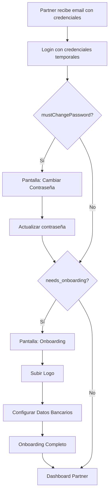
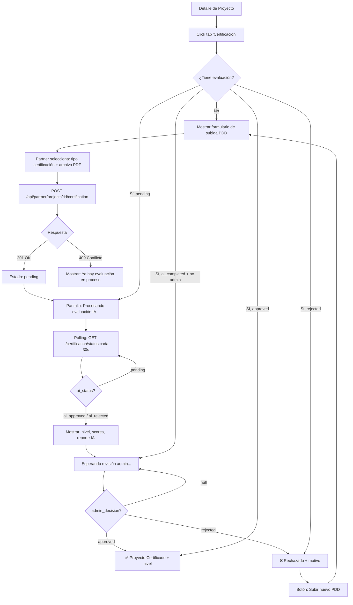

# 📘 Documentación Frontend - Módulo Partner (Impact Partner / ESG Partner)

> **Versión**: 2.0.0  
> **Última actualización**: Marzo 2026  
> **Backend**: Node.js / Express / REST API  
> **Base URL**: `https://api.compensatuviaje.com` (producción) | `http://localhost:3001` (desarrollo)  
> **Cambios v2**: Se agrega verificación empresarial KYB (Agent 1) y certificación de proyectos (Agent 2)

---

## 📑 Índice

1. [Rol: Partner](#1-rol-partner)
2. [Pantallas Frontend](#2-pantallas-frontend)
   - 2.1–2.8 Pantallas existentes (login, onboarding, dashboard, proyectos, perfil)
   - **2.9 Verificación Empresarial KYB (Agent 1)** ← NUEVO
   - **2.10 Certificación de Proyectos ESG (Agent 2)** ← NUEVO
3. [Flujos de Usuario](#3-flujos-de-usuario)
   - 3.1–3.3 Flujos existentes
   - **3.4 Flujo KYB** ← NUEVO
   - **3.5 Flujo Certificación Proyecto** ← NUEVO
4. [Contratos API](#4-contratos-api)
   - 4.1–4.4 Contratos existentes
   - **4.5 API KYB** ← NUEVO
   - **4.6 API Certificación** ← NUEVO
5. [Reglas de Negocio](#5-reglas-de-negocio)
6. [Consideraciones UI/UX](#6-consideraciones-uiux)

---

## 1. Rol: Partner

### 1.1 Descripción

El **Impact Partner** (también llamado **ESG Partner**) es una organización que provee proyectos de compensación de carbono a la plataforma CompensaTuViaje. Estos partners gestionan proyectos como:

- 🌳 Reforestación
- 🌊 Conservación marina
- ⚡ Energía renovable
- 🌱 Agricultura sostenible

### 1.2 Características del Usuario Partner

| Atributo | Descripción |
|----------|-------------|
| **Tipo de cuenta** | Invite-only (solo SuperAdmin puede crear) |
| **Credenciales** | Recibidas por email |
| **Primer login** | Debe cambiar contraseña temporal |
| **Onboarding** | Debe completar perfil antes de crear proyectos |

### 1.3 Permisos del Rol `PARTNER_ADMIN`

```
partner.profile.read      - Ver perfil del partner
partner.profile.update    - Actualizar perfil, logo, datos bancarios
partner.projects.create   - Crear proyectos ESG
partner.projects.read     - Ver proyectos propios
partner.projects.update   - Actualizar proyectos propios
partner.projects.delete   - Eliminar proyectos (solo drafts)
partner.evidence.upload   - Subir documentación
partner.evidence.read     - Ver evidencia cargada
partner.dashboard.view    - Ver métricas y estadísticas
```

### 1.4 Restricciones

| Restricción | Descripción |
|-------------|-------------|
| ❌ No puede crear otros usuarios | Solo hay 1 admin por Partner |
| ❌ No puede ver proyectos de otros Partners | Aislamiento total |
| ❌ No puede aprobar sus propios proyectos | Requiere revisión de SuperAdmin |
| ❌ No puede editar proyectos enviados a revisión | Solo en estado `draft` |
| ❌ No puede crear proyectos sin onboarding | Debe completar perfil primero |

---

## 2. Pantallas Frontend

### 2.1 Pantalla: Login Partner

| Propiedad | Valor |
|-----------|-------|
| **Nombre** | `PartnerLogin` |
| **Ruta** | `/partner/login` |
| **Objetivo** | Autenticación del usuario Partner |

#### Componentes UI

```
┌─────────────────────────────────────────────┐
│                    LOGO                      │
│           CompensaTuViaje Partner           │
├─────────────────────────────────────────────┤
│  ┌─────────────────────────────────────┐   │
│  │ 📧 Email                            │   │
│  └─────────────────────────────────────┘   │
│  ┌─────────────────────────────────────┐   │
│  │ 🔒 Contraseña                       │   │
│  └─────────────────────────────────────┘   │
│                                             │
│  [        Iniciar Sesión        ]          │
│                                             │
│  ¿Olvidaste tu contraseña?                 │
└─────────────────────────────────────────────┘
```

#### Estados

| Estado | Descripción | Acción UI |
|--------|-------------|-----------|
| `loading` | Validando credenciales | Spinner en botón, inputs deshabilitados |
| `error` | Credenciales inválidas | Toast/Alert rojo con mensaje |
| `success` | Login exitoso | Redirect según `needs_onboarding` |
| `must_change_password` | Contraseña temporal | Redirect a `/partner/change-password` |

---

### 2.2 Pantalla: Cambiar Contraseña (Primer Login)

| Propiedad | Valor |
|-----------|-------|
| **Nombre** | `PartnerChangePassword` |
| **Ruta** | `/partner/change-password` |
| **Objetivo** | Forzar cambio de contraseña temporal |

#### Componentes UI

```
┌─────────────────────────────────────────────┐
│         🔐 Cambiar Contraseña               │
│   Tu cuenta requiere una nueva contraseña   │
├─────────────────────────────────────────────┤
│  ┌─────────────────────────────────────┐   │
│  │ Contraseña actual                   │   │
│  └─────────────────────────────────────┘   │
│  ┌─────────────────────────────────────┐   │
│  │ Nueva contraseña                    │   │
│  └─────────────────────────────────────┘   │
│  ┌─────────────────────────────────────┐   │
│  │ Confirmar nueva contraseña          │   │
│  └─────────────────────────────────────┘   │
│                                             │
│  ✅ Mínimo 8 caracteres                    │
│  ✅ Al menos una mayúscula                 │
│  ✅ Al menos un número                     │
│                                             │
│  [       Actualizar Contraseña      ]      │
└─────────────────────────────────────────────┘
```

---

### 2.3 Pantalla: Onboarding Partner

| Propiedad | Valor |
|-----------|-------|
| **Nombre** | `PartnerOnboarding` |
| **Ruta** | `/partner/onboarding` |
| **Objetivo** | Completar perfil antes de operar |

#### Componentes UI (Stepper/Wizard)

```
┌─────────────────────────────────────────────────────────────┐
│  Paso 1 de 2: Información de la Organización               │
│  ━━━━━━━━━━━━━━━━━━━━━○○○○○○                               │
├─────────────────────────────────────────────────────────────┤
│                                                             │
│  ┌─────────────────┐  Nombre de la Organización            │
│  │  🏢 Logo        │  [________________________]           │
│  │  (drag & drop)  │                                       │
│  │  o click para   │  Email de Contacto                    │
│  │  seleccionar    │  [________________________]           │
│  └─────────────────┘                                       │
│                        Sitio Web                           │
│                        [________________________]           │
│                                                             │
│  [  Anterior  ]                    [  Siguiente  ]         │
└─────────────────────────────────────────────────────────────┘

┌─────────────────────────────────────────────────────────────┐
│  Paso 2 de 2: Datos Bancarios                              │
│  ━━━━━━━━━━━━━━━━━━━━━━━━━━━━━━                            │
├─────────────────────────────────────────────────────────────┤
│                                                             │
│  Banco               [  Seleccionar banco ▼  ]             │
│                                                             │
│  Tipo de Cuenta      ○ Cuenta Corriente  ○ Cuenta Vista    │
│                                                             │
│  Número de Cuenta    [________________________]             │
│                                                             │
│  Titular de la Cuenta [________________________]            │
│                                                             │
│  RUT del Titular     [________________________]             │
│                                                             │
│  🔒 Estos datos son confidenciales y se usan únicamente    │
│     para transferir los pagos por compensaciones           │
│                                                             │
│  [  Anterior  ]                    [  Completar  ]         │
└─────────────────────────────────────────────────────────────┘
```

#### Estados del Onboarding

| Estado | Indicador Visual |
|--------|-----------------|
| `logo` pendiente | Badge rojo en paso 1 |
| `bank_details` pendiente | Badge rojo en paso 2 |
| Completado | Check verde, redirect a dashboard |

---

### 2.4 Pantalla: Dashboard Partner

| Propiedad | Valor |
|-----------|-------|
| **Nombre** | `PartnerDashboard` |
| **Ruta** | `/partner/dashboard` |
| **Objetivo** | Vista general del estado del Partner |

#### Componentes UI

```
┌─────────────────────────────────────────────────────────────────────────┐
│  🏢 EcoForest Chile                                     [Ver Perfil]   │
├─────────────────────────────────────────────────────────────────────────┤
│                                                                         │
│  ┌─────────────┐  ┌─────────────┐  ┌─────────────┐  ┌─────────────┐   │
│  │  Proyectos  │  │   Activos   │  │  Pendientes │  │  Borradores │   │
│  │      5      │  │      2      │  │      1      │  │      2      │   │
│  │   Total     │  │  🟢 Active  │  │  🟡 Review  │  │  ⚪ Draft   │   │
│  └─────────────┘  └─────────────┘  └─────────────┘  └─────────────┘   │
│                                                                         │
│  ┌─────────────────────────────────────────────────────────────────┐   │
│  │  📊 Estadísticas de Compensación (Próximamente)                 │   │
│  │  ━━━━━━━━━━━━━━━━━━━━━━━━━━━━━━━━━━━━━━━━━━━━━━━━━━━━━━━━━━━  │   │
│  │  Total Certificados: -        │  Total kg CO₂: -              │   │
│  │  Ingresos Totales: -                                          │   │
│  └─────────────────────────────────────────────────────────────────┘   │
│                                                                         │
│  ┌─────────────────────────────────────────────────────────────────┐   │
│  │  Mis Proyectos                              [+ Nuevo Proyecto]  │   │
│  ├─────────────────────────────────────────────────────────────────┤   │
│  │  🌳 Bosque Nativo Nahuelbuta        │ Active  │ $5,000/u       │   │
│  │  🌊 Conservación Costa Valdiviana   │ Review  │ $3,500/u       │   │
│  │  ⚡ Parque Solar Atacama            │ Draft   │ $4,200/u       │   │
│  └─────────────────────────────────────────────────────────────────┘   │
└─────────────────────────────────────────────────────────────────────────┘
```

---

### 2.5 Pantalla: Lista de Proyectos

| Propiedad | Valor |
|-----------|-------|
| **Nombre** | `PartnerProjectsList` |
| **Ruta** | `/partner/projects` |
| **Objetivo** | Gestionar proyectos ESG del Partner |

#### Componentes UI

```
┌─────────────────────────────────────────────────────────────────────────┐
│  Mis Proyectos ESG                                  [+ Nuevo Proyecto] │
├─────────────────────────────────────────────────────────────────────────┤
│  Filtros: [Todos ▼]  [Tipo ▼]  🔍 Buscar...                           │
├─────────────────────────────────────────────────────────────────────────┤
│                                                                         │
│  ┌───────────────────────────────────────────────────────────────────┐ │
│  │ 🌳 Bosque Nativo Nahuelbuta                                       │ │
│  │ Reforestación • Biobío, Chile                                     │ │
│  │ ━━━━━━━━━━━━━━━━━━━━━━━━━━━━━━━━━━━━━━━━━━━━━━━━━━ 75% vendido   │ │
│  │ 🟢 Activo    │ $5,000 CLP/unidad │ 0.5 ton CO₂/u   [Ver] [Editar]│ │
│  └───────────────────────────────────────────────────────────────────┘ │
│                                                                         │
│  ┌───────────────────────────────────────────────────────────────────┐ │
│  │ 🌊 Conservación Costa Valdiviana                                  │ │
│  │ Conservación marina • Los Ríos, Chile                            │ │
│  │ 🟡 Pendiente de Revisión                        [Ver] [Cancelar] │ │
│  └───────────────────────────────────────────────────────────────────┘ │
│                                                                         │
│  ┌───────────────────────────────────────────────────────────────────┐ │
│  │ ⚡ Parque Solar Atacama                                          │ │
│  │ Energía renovable • Antofagasta, Chile                           │ │
│  │ ⚪ Borrador                          [Ver] [Editar] [Eliminar]   │ │
│  └───────────────────────────────────────────────────────────────────┘ │
│                                                                         │
│  ← 1 2 3 →                                        Mostrando 1-10 de 15 │
└─────────────────────────────────────────────────────────────────────────┘
```

#### Estados de Proyecto (Badges)

| Estado | Color | Icono | Acciones Permitidas |
|--------|-------|-------|---------------------|
| `draft` | Gris | ⚪ | Ver, Editar, Eliminar, Enviar a Revisión |
| `pending_review` | Amarillo | 🟡 | Ver (solo lectura) |
| `approved` | Azul | 🔵 | Ver |
| `rejected` | Rojo | 🔴 | Ver, Editar (vuelve a draft) |
| `active` | Verde | 🟢 | Ver |
| `paused` | Naranja | 🟠 | Ver |
| `completed` | Gris oscuro | ⚫ | Ver |

---

### 2.6 Pantalla: Crear/Editar Proyecto

| Propiedad | Valor |
|-----------|-------|
| **Nombre** | `PartnerProjectForm` |
| **Ruta** | `/partner/projects/new` o `/partner/projects/:id/edit` |
| **Objetivo** | Formulario completo de proyecto ESG |

#### Componentes UI (Formulario en Tabs)

```
┌─────────────────────────────────────────────────────────────────────────┐
│  Nuevo Proyecto ESG                                                     │
│  [Información] [Métricas] [Transparencia] [Documentos]                 │
├─────────────────────────────────────────────────────────────────────────┤
│  TAB: Información Básica                                               │
│  ─────────────────────────────────────────────────────────────────────  │
│                                                                         │
│  Nombre del Proyecto *                                                  │
│  [_______________________________________________]                      │
│                                                                         │
│  Código del Proyecto *          Tipo de Proyecto *                     │
│  [______________]               [ Seleccionar tipo ▼ ]                 │
│                                                                         │
│  Descripción *                                                          │
│  ┌─────────────────────────────────────────────────────────────────┐   │
│  │                                                                  │   │
│  │                                                                  │   │
│  └─────────────────────────────────────────────────────────────────┘   │
│                                                                         │
│  País *                         Ubicación                              │
│  [ Chile ▼ ]                    [___________________________]          │
│                                                                         │
│  Organización Proveedora *                                             │
│  [_______________________________________________]                      │
│                                                                         │
└─────────────────────────────────────────────────────────────────────────┘

┌─────────────────────────────────────────────────────────────────────────┐
│  TAB: Métricas de Compensación                                         │
│  ─────────────────────────────────────────────────────────────────────  │
│                                                                         │
│  Costo por Unidad (CLP) *       Captura de Carbono (ton CO₂/unidad)   │
│  [_________________]            [_________________]                     │
│                                                                         │
│  Capacidad Total (unidades) *   Capacidad Vendida                      │
│  [_________________]            [_________________] (solo lectura)      │
│                                                                         │
│  ┌─────────────────────────────────────────────────────────────────┐   │
│  │  📊 Impacto Proyectado                                          │   │
│  │  ━━━━━━━━━━━━━━━━━━━━━━━━━━━━━━━━━━━━━━━━━━━━━━━━━━━━━━━━━━━━  │   │
│  │  Captura total potencial: 5,000 ton CO₂                         │   │
│  │  Valor total potencial: $50,000,000 CLP                         │   │
│  └─────────────────────────────────────────────────────────────────┘   │
│                                                                         │
└─────────────────────────────────────────────────────────────────────────┘

┌─────────────────────────────────────────────────────────────────────────┐
│  TAB: Transparencia                                                     │
│  ─────────────────────────────────────────────────────────────────────  │
│                                                                         │
│  URL de Transparencia                                                   │
│  [https://___________________________________________]                  │
│  💡 Página pública donde se puede verificar el proyecto                │
│                                                                         │
│  URL de Imagen Principal                                                │
│  [https://___________________________________________]                  │
│                                                                         │
│  Certificaciones (separadas por coma)                                   │
│  [Gold Standard, VCS, ___________________________]                     │
│                                                                         │
└─────────────────────────────────────────────────────────────────────────┘
```

#### Botones de Acción

```
┌─────────────────────────────────────────────────────────────────────────┐
│                                                                         │
│  [Cancelar]    [Guardar Borrador]    [Enviar a Revisión]              │
│                                                                         │
└─────────────────────────────────────────────────────────────────────────┘
```

---

### 2.7 Pantalla: Detalle de Proyecto

| Propiedad | Valor |
|-----------|-------|
| **Nombre** | `PartnerProjectDetail` |
| **Ruta** | `/partner/projects/:id` |
| **Objetivo** | Vista detallada de un proyecto |

#### Componentes UI

```
┌─────────────────────────────────────────────────────────────────────────┐
│  ← Volver                                                               │
│                                                                         │
│  🌳 Bosque Nativo Nahuelbuta                              🟢 Activo    │
│  Reforestación • Biobío, Chile                                         │
├─────────────────────────────────────────────────────────────────────────┤
│                                                                         │
│  ┌────────────────────────────────┐  ┌────────────────────────────────┐│
│  │  📊 Métricas                   │  │  💰 Financiero                 ││
│  │  ─────────────────────────────  │  │  ─────────────────────────────  ││
│  │  Captura: 0.5 ton CO₂/unidad  │  │  Costo: $5,000 CLP/unidad     ││
│  │  Capacidad: 10,000 unidades   │  │  Total: $50,000,000 CLP       ││
│  │  Vendido: 7,500 (75%)         │  │  Vendido: $37,500,000 CLP     ││
│  │  Disponible: 2,500            │  │                                ││
│  │  ━━━━━━━━━━━━━━━━━ 75%        │  │                                ││
│  └────────────────────────────────┘  └────────────────────────────────┘│
│                                                                         │
│  📝 Descripción                                                         │
│  ─────────────────────────────────────────────────────────────────────  │
│  Proyecto de reforestación con especies nativas en la Cordillera de    │
│  Nahuelbuta, región del Biobío. Contribuye a la restauración del      │
│  ecosistema y captura de carbono atmosférico.                          │
│                                                                         │
│  🔗 Transparencia                                                       │
│  ─────────────────────────────────────────────────────────────────────  │
│  🌐 [Ver página del proyecto]  📄 [Ver certificaciones]                │
│                                                                         │
│  📎 Documentos y Evidencia                                             │
│  ─────────────────────────────────────────────────────────────────────  │
│  📄 Certificado Gold Standard.pdf                         [Descargar] │
│  📄 Informe Anual 2025.pdf                                [Descargar] │
│  🖼️ Galería de fotos                                      [Ver]       │
│                                                                         │
└─────────────────────────────────────────────────────────────────────────┘
```

---

### 2.8 Pantalla: Perfil del Partner

| Propiedad | Valor |
|-----------|-------|
| **Nombre** | `PartnerProfile` |
| **Ruta** | `/partner/profile` |
| **Objetivo** | Ver y editar información del Partner |

#### Componentes UI

```
┌─────────────────────────────────────────────────────────────────────────┐
│  Mi Perfil                                                   [Editar]  │
├─────────────────────────────────────────────────────────────────────────┤
│                                                                         │
│  ┌─────────────┐  EcoForest Chile SpA                                  │
│  │             │  📧 contacto@ecoforest.cl                             │
│  │    LOGO     │  🌐 https://ecoforest.cl                              │
│  │             │  📍 Chile                                              │
│  └─────────────┘                                                        │
│                                                                         │
│  Estado de la Cuenta                                                    │
│  ─────────────────────────────────────────────────────────────────────  │
│  ✅ Perfil completado                                                   │
│  ✅ Datos bancarios configurados                                        │
│  🏢 KYB: 🟢 Aprobado (Tier: GOLD, Score: 85/100)                       │
│  🟢 Cuenta Activa                                                       │
│                                                                         │
│  Datos Bancarios                                           [Editar]    │
│  ─────────────────────────────────────────────────────────────────────  │
│  Banco: Banco Estado                                                   │
│  Tipo: Cuenta Corriente                                                │
│  Número: ********4567                                                  │
│  Titular: EcoForest SpA                                                │
│                                                                         │
│  Seguridad                                                              │
│  ─────────────────────────────────────────────────────────────────────  │
│  [Cambiar Contraseña]                                                  │
│                                                                         │
└─────────────────────────────────────────────────────────────────────────┘
```

---

### 2.9 Pantalla: Verificación Empresarial KYB (Agent 1) 🆕

| Propiedad | Valor |
|-----------|-------|
| **Nombre** | `PartnerKybVerification` |
| **Ruta** | `/partner/kyb` |
| **Objetivo** | Gestionar la verificación empresarial del partner |
| **Cuándo aparece** | Siempre visible en sidebar. Obligatorio antes de poder operar. |

#### Estado Inicial: Sin Verificación

```
┌─────────────────────────────────────────────────────────────────────────┐
│  🏢 Verificación Empresarial (KYB)                                      │
├─────────────────────────────────────────────────────────────────────────┤
│                                                                         │
│  ┌─────────────────────────────────────────────────────────────────┐   │
│  │  ⚠️ Tu empresa aún no ha sido verificada                       │   │
│  │                                                                  │   │
│  │  Para activar tu cuenta y operar en la plataforma, necesitas    │   │
│  │  enviar tus documentos empresariales para evaluación.            │   │
│  │                                                                  │   │
│  │  Nuestra IA evaluará:                                            │   │
│  │  • 📋 Documentación legal                                       │   │
│  │  • 💰 Solidez financiera                                        │   │
│  │  • ⚙️ Capacidad técnica                                         │   │
│  │  • 📞 Referencias comerciales                                   │   │
│  └─────────────────────────────────────────────────────────────────┘   │
│                                                                         │
│  Subir Dossier KYB                                                      │
│  ─────────────────                                                      │
│  Nombre de la Organización *                                            │
│  [_______________________________________________]                      │
│                                                                         │
│  RUT Tributario *                                                       │
│  [_______________________________________________]                      │
│                                                                         │
│  ┌─────────────────────────────────────────────────────────────────┐   │
│  │                                                                  │   │
│  │      📄 Arrastra tu dossier empresarial aquí                    │   │
│  │         o haz clic para seleccionar                              │   │
│  │                                                                  │   │
│  │      Formato: PDF • Máximo: 10MB                                │   │
│  │                                                                  │   │
│  └─────────────────────────────────────────────────────────────────┘   │
│                                                                         │
│  [        Enviar para Evaluación        ]                              │
│                                                                         │
└─────────────────────────────────────────────────────────────────────────┘
```

#### Estado: Evaluación en Proceso (IA procesando)

```
┌─────────────────────────────────────────────────────────────────────────┐
│  🏢 Verificación Empresarial (KYB)                                      │
├─────────────────────────────────────────────────────────────────────────┤
│                                                                         │
│  ┌─────────────────────────────────────────────────────────────────┐   │
│  │  🔄 Evaluación en Proceso                                       │   │
│  │                                                                  │   │
│  │  Tu dossier fue recibido y está siendo evaluado por nuestra     │   │
│  │  IA. Este proceso puede tomar de algunas horas hasta un día.     │   │
│  │                                                                  │   │
│  │  📄 Documento: documentos_ecoforest_2026.pdf                    │   │
│  │  📅 Enviado: 10 de Marzo, 2026 a las 14:30                     │   │
│  │                                                                  │   │
│  │  ━━━━━━━━━━━━━━━━━━━○○○○○○  Procesando...                      │   │
│  └─────────────────────────────────────────────────────────────────┘   │
│                                                                         │
└─────────────────────────────────────────────────────────────────────────┘
```

#### Estado: IA Completó - Pendiente Admin

```
┌─────────────────────────────────────────────────────────────────────────┐
│  🏢 Verificación Empresarial (KYB)                                      │
├─────────────────────────────────────────────────────────────────────────┤
│                                                                         │
│  ┌─────────────────────────────────────────────────────────────────┐   │
│  │  🤖 Evaluación IA Completada - Pendiente Revisión Admin        │   │
│  │                                                                  │   │
│  │  La evaluación automática ha finalizado. Ahora un administrador │   │
│  │  revisará los resultados antes de activar tu cuenta.             │   │
│  └─────────────────────────────────────────────────────────────────┘   │
│                                                                         │
│  Resultados IA                                                          │
│  ─────────────────                                                      │
│  ┌──────────────────┐ ┌──────────────────┐ ┌──────────────────┐       │
│  │ 📊 Score General │ │ 🏅 Tier          │ │ 🤖 Decisión IA  │       │
│  │      85/100      │ │     GOLD         │ │   ✅ Aprobado    │       │
│  └──────────────────┘ └──────────────────┘ └──────────────────┘       │
│                                                                         │
│  ┌────────────┐ ┌────────────┐ ┌────────────┐ ┌────────────┐         │
│  │ 📋 Legal   │ │ 💰 Financ. │ │ ⚙️ Técnico │ │ 📞 Refer.  │         │
│  │   90/100   │ │   80/100   │ │   85/100   │ │   82/100   │         │
│  │ ━━━━━━━━━━ │ │ ━━━━━━━━   │ │ ━━━━━━━━━  │ │ ━━━━━━━━   │         │
│  └────────────┘ └────────────┘ └────────────┘ └────────────┘         │
│                                                                         │
│  ⏳ Esperando revisión del equipo de administración...                  │
│                                                                         │
└─────────────────────────────────────────────────────────────────────────┘
```

#### Estado: KYB Aprobado ✅

```
┌─────────────────────────────────────────────────────────────────────────┐
│  🏢 Verificación Empresarial (KYB)                                      │
├─────────────────────────────────────────────────────────────────────────┤
│                                                                         │
│  ┌─────────────────────────────────────────────────────────────────┐   │
│  │  ✅ Empresa Verificada                                          │   │
│  │                                                                  │   │
│  │  🏅 Tier: GOLD           📊 Score: 85/100                      │   │
│  │  📅 Verificada: 11 de Marzo, 2026                               │   │
│  │                                                                  │   │
│  │  Tu empresa ha sido verificada exitosamente. Tu cuenta está     │   │
│  │  activa y puedes operar en la plataforma.                        │   │
│  └─────────────────────────────────────────────────────────────────┘   │
│                                                                         │
│  Scores de Evaluación                                                   │
│  ┌────────────┐ ┌────────────┐ ┌────────────┐ ┌────────────┐         │
│  │ 📋 Legal   │ │ 💰 Financ. │ │ ⚙️ Técnico │ │ 📞 Refer.  │         │
│  │   90/100   │ │   80/100   │ │   85/100   │ │   82/100   │         │
│  └────────────┘ └────────────┘ └────────────┘ └────────────┘         │
│                                                                         │
│  📜 Historial de Evaluaciones                                          │
│  ├─ ✅ 2026-03-11 │ GOLD │ Score: 85 │ Aprobado por admin            │
│                                                                         │
└─────────────────────────────────────────────────────────────────────────┘
```

#### Estado: KYB Rechazado ❌

```
┌─────────────────────────────────────────────────────────────────────────┐
│  🏢 Verificación Empresarial (KYB)                                      │
├─────────────────────────────────────────────────────────────────────────┤
│                                                                         │
│  ┌─────────────────────────────────────────────────────────────────┐   │
│  │  ❌ Verificación Rechazada                                      │   │
│  │                                                                  │   │
│  │  Motivo: "La documentación financiera presentada está           │   │
│  │  incompleta. Se requieren estados financieros de los últimos    │   │
│  │  3 años auditados."                                              │   │
│  │                                                                  │   │
│  │  Puedes corregir la documentación y volver a enviarla.          │   │
│  └─────────────────────────────────────────────────────────────────┘   │
│                                                                         │
│  [        Enviar Nueva Documentación        ]                          │
│                                                                         │
│  📜 Historial de Evaluaciones                                          │
│  ├─ ❌ 2026-03-11 │ Score: 45 │ Rechazado: "Documentación..."        │
│                                                                         │
└─────────────────────────────────────────────────────────────────────────┘
```

#### Resumen de Estados y Badges KYB

| ai_status | admin_decision | Badge | Color | Texto |
|-----------|---------------|-------|-------|-------|
| `pending` | `null` | 🔄 | Azul | "Procesando evaluación IA..." |
| `ai_approved` | `null` | 🤖✅ | Amarillo | "IA aprobó - Pendiente revisión admin" |
| `ai_rejected` | `null` | 🤖❌ | Naranja | "IA rechazó - Pendiente revisión admin" |
| `ai_approved` | `approved` | ✅ | Verde | "Verificado" |
| `ai_rejected` | `approved` | ✅ | Verde | "Verificado (override admin)" |
| cualquiera | `rejected` | ❌ | Rojo | "Rechazado" |
| `error` | `null` | ⚠️ | Rojo | "Error en evaluación" |

---

### 2.10 Pantalla: Certificación de Proyecto ESG (Agent 2) 🆕

| Propiedad | Valor |
|-----------|-------|
| **Nombre** | `PartnerProjectCertification` |
| **Ruta** | `/partner/projects/:id/certification` |
| **Objetivo** | Subir PDD y ver estado de certificación del proyecto |
| **Cuándo aparece** | Tab o sección dentro del detalle de proyecto |

#### Estado Inicial: Sin Certificación

```
┌─────────────────────────────────────────────────────────────────────────┐
│  ← Volver a Proyecto                                                    │
│                                                                         │
│  📜 Certificación de Proyecto: Bosque Nativo Nahuelbuta                │
├─────────────────────────────────────────────────────────────────────────┤
│                                                                         │
│  ┌─────────────────────────────────────────────────────────────────┐   │
│  │  📄 Este proyecto aún no tiene certificación                    │   │
│  │                                                                  │   │
│  │  Sube tu documento PDD (Project Design Document) para iniciar   │   │
│  │  la evaluación automática de impacto ESG del proyecto.           │   │
│  └─────────────────────────────────────────────────────────────────┘   │
│                                                                         │
│  Subir Documento PDD                                                    │
│  ────────────────────                                                   │
│  Tipo de Certificación *                                                │
│  [ Seleccionar tipo ▼ ]                                                │
│  Opciones: PDD, VVB, Gold Standard, VCS, otro                         │
│                                                                         │
│  ┌─────────────────────────────────────────────────────────────────┐   │
│  │                                                                  │   │
│  │      📄 Arrastra tu PDD aquí                                    │   │
│  │         o haz clic para seleccionar                              │   │
│  │                                                                  │   │
│  │      Formato: PDF • Máximo: 10MB                                │   │
│  │                                                                  │   │
│  └─────────────────────────────────────────────────────────────────┘   │
│                                                                         │
│  [        Enviar para Certificación        ]                           │
│                                                                         │
└─────────────────────────────────────────────────────────────────────────┘
```

#### Estado: IA Completó - Resultados + Pendiente Admin

```
┌─────────────────────────────────────────────────────────────────────────┐
│  📜 Certificación: Bosque Nativo Nahuelbuta                             │
├─────────────────────────────────────────────────────────────────────────┤
│                                                                         │
│  ┌─────────────────────────────────────────────────────────────────┐   │
│  │  🤖 Evaluación IA Completada - Pendiente Revisión Admin        │   │
│  └─────────────────────────────────────────────────────────────────┘   │
│                                                                         │
│  ┌──────────────────┐ ┌──────────────────┐ ┌──────────────────┐       │
│  │ 🏅 Nivel         │ │ 📊 Score Final   │ │ 🔍 Confianza    │       │
│  │   ORO            │ │     87/100       │ │     92%          │       │
│  └──────────────────┘ └──────────────────┘ └──────────────────┘       │
│                                                                         │
│  Scores Detallados                                                      │
│  ┌────────────────┐  ┌────────────────┐  ┌────────────────┐           │
│  │ 🌱 Ambiental B │  │ 📄 Document. D │  │ ⚡ Ejecución E │           │
│  │     90/100     │  │     85/100     │  │     86/100     │           │
│  │ ━━━━━━━━━━━━━  │  │ ━━━━━━━━━━━━   │  │ ━━━━━━━━━━━━   │           │
│  └────────────────┘  └────────────────┘  └────────────────┘           │
│                                                                         │
│  🏷️ Tipo detectado: "Solar Energy"                                     │
│  📋 Certificación: PDD                                                  │
│                                                                         │
│  📝 Reporte IA                                            [Expandir]  │
│  ─────────────────────────────────────────────────────────────────────  │
│  │ # Reporte de Evaluación ESG                                       │  │
│  │ ## Resumen Ejecutivo                                              │  │
│  │ El proyecto muestra un alto nivel de impacto ambiental...         │  │
│  │                                                    [Ver completo] │  │
│                                                                         │
│  ⏳ Esperando revisión del equipo de administración...                  │
│                                                                         │
└─────────────────────────────────────────────────────────────────────────┘
```

#### Estado: Certificación Aprobada ✅

```
┌─────────────────────────────────────────────────────────────────────────┐
│  📜 Certificación: Bosque Nativo Nahuelbuta                             │
├─────────────────────────────────────────────────────────────────────────┤
│                                                                         │
│  ┌─────────────────────────────────────────────────────────────────┐   │
│  │  ✅ Proyecto Certificado                                        │   │
│  │                                                                  │   │
│  │  🏅 Nivel: ORO        📊 Score: 87/100   🔍 Confianza: 92%    │   │
│  │  📅 Certificado: 12 de Marzo, 2026                              │   │
│  └─────────────────────────────────────────────────────────────────┘   │
│                                                                         │
│  📝 Reporte IA Completo                                                │
│  ─────────────────────────────────────────────────────────────────────  │
│  [Renderizar report_markdown como HTML enriquecido]                    │
│                                                                         │
│  📜 Historial de Evaluaciones                                          │
│  ├─ ✅ 2026-03-12 │ ORO │ Score: 87 │ Aprobado por admin             │
│                                                                         │
└─────────────────────────────────────────────────────────────────────────┘
```

#### Estado: Certificación Rechazada ❌

```
┌─────────────────────────────────────────────────────────────────────────┐
│  📜 Certificación: Bosque Nativo Nahuelbuta                             │
├─────────────────────────────────────────────────────────────────────────┤
│                                                                         │
│  ┌─────────────────────────────────────────────────────────────────┐   │
│  │  ❌ Certificación Rechazada                                     │   │
│  │                                                                  │   │
│  │  Motivo: "El PDD no cumple con el estándar ISO 14001. Se        │   │
│  │  requiere documentación adicional de línea base."                │   │
│  │                                                                  │   │
│  │  Puedes subir un nuevo documento PDD corregido.                 │   │
│  └─────────────────────────────────────────────────────────────────┘   │
│                                                                         │
│  [        Subir Nuevo PDD        ]                                     │
│                                                                         │
│  📜 Historial de Evaluaciones                                          │
│  ├─ ❌ 2026-03-12 │ Score: 42 │ Rechazado: "El PDD no cumple..."     │
│                                                                         │
└─────────────────────────────────────────────────────────────────────────┘
```

#### Niveles de Certificación (Badges)

| Nivel | Color | Rango Score |
|-------|-------|-------------|
| 🏆 PLATINO IMPACTO | Plateado/Diamante | 90-100 |
| 🥇 ORO | Dorado | 70-89 |
| 🥈 PLATA | Gris plata | 50-69 |
| ❌ RECHAZADO | Rojo | < 50 |

#### Resumen de Estados y Badges Certificación

| ai_status | admin_decision | Badge | Color | Texto |
|-----------|---------------|-------|-------|-------|
| `pending` | `null` | 🔄 | Azul | "Procesando evaluación IA..." |
| `ai_approved` | `null` | 🤖✅ | Amarillo | "IA aprobó - Pendiente revisión admin" |
| `ai_rejected` | `null` | 🤖❌ | Naranja | "IA rechazó - Pendiente revisión admin" |
| cualquiera | `approved` | ✅ | Verde | "Certificado" + nivel |
| cualquiera | `rejected` | ❌ | Rojo | "Rechazado" + motivo |
| `error` | `null` | ⚠️ | Rojo | "Error en evaluación" |

---

## 3. Flujos de Usuario

### 3.1 Flujo: Primer Login y Onboarding



### 3.2 Flujo: Crear Proyecto ESG

```mermaid
flowchart TD
    A[Dashboard] --> B[Click "Nuevo Proyecto"]
    B --> C[Formulario: Información Básica]
    C --> D[Formulario: Métricas]
    D --> E[Formulario: Transparencia]
    E --> F{¿Guardar o Enviar?}
    F -->|Guardar Borrador| G[Estado: draft]
    G --> H[Puede editar después]
    F -->|Enviar a Revisión| I{Validación completa?}
    I -->|No| J[Mostrar errores]
    J --> C
    I -->|Sí| K[Estado: pending_review]
    K --> L[Esperar aprobación SuperAdmin]
    L --> M{Resultado}
    M -->|Aprobado| N[Estado: approved]
    M -->|Rechazado| O[Estado: rejected]
    O --> P[Notificación con motivo]
    P --> Q[Partner puede editar y reenviar]
    N --> R[SuperAdmin activa]
    R --> S[Estado: active]
```

### 3.3 Flujo: Consultar Estado de Validación

```mermaid
flowchart TD
    A[Lista de Proyectos] --> B[Ver proyecto específico]
    B --> C{Estado actual}
    C -->|draft| D[Mostrar: "Borrador - Puedes seguir editando"]
    C -->|pending_review| E[Mostrar: "En revisión - Esperando aprobación"]
    C -->|approved| F[Mostrar: "Aprobado - Listo para activar"]
    C -->|rejected| G[Mostrar: "Rechazado" + motivo]
    G --> H[Botón: "Editar y Reenviar"]
    C -->|active| I[Mostrar: "Activo - Recibiendo compensaciones"]
    I --> J[Mostrar métricas de venta]
```

### 3.4 Flujo: Verificación Empresarial KYB (Agent 1) 🆕

```mermaid
flowchart TD
    A[Dashboard / Sidebar] --> B[Click "Verificación KYB"]
    B --> C{¿Tiene evaluación?}
    
    C -->|No| D[Mostrar formulario de subida]
    D --> E[Partner llena: nombre org, RUT, archivo PDF]
    E --> F[POST /api/partner/kyb]
    F --> G{Respuesta}
    G -->|201 OK| H[Estado: pending]
    G -->|409 Conflicto| I[Mostrar: Ya hay evaluación en proceso]
    
    H --> J[Pantalla: Procesando evaluación IA...]
    J --> K[Polling: GET /api/partner/kyb/status cada 30s]
    
    K --> L{ai_status?}
    L -->|pending| K
    L -->|ai_approved / ai_rejected| M[Mostrar scores + insights]
    M --> N[Esperando revisión admin...]
    
    N --> O{admin_decision?}
    O -->|null| N
    O -->|approved| P["✅ Empresa Verificada<br/>Partner status → active"]
    O -->|rejected| Q["❌ Rechazado + motivo"]
    Q --> R[Botón: Enviar nueva documentación]
    R --> D
    
    C -->|Sí, pending| J
    C -->|Sí, ai_approved/rejected + no admin| N
    C -->|Sí, approved| P
    C -->|Sí, rejected| Q
```

### 3.5 Flujo: Certificación de Proyecto ESG (Agent 2) 🆕



---

## 4. Contratos API

### 4.1 Autenticación

#### POST `/api/public/auth/login`

**Descripción**: Login para todos los tipos de usuario (detecta automáticamente Partner)

**Request:**
```json
{
  "email": "admin@ecoforest.cl",
  "password": "contraseña_temporal"
}
```

**Response 200 (Partner):**
```json
{
  "success": true,
  "message": "Login successful",
  "data": {
    "token": "eyJhbGciOiJIUzI1NiIs...",
    "user": {
      "id": "uuid-user-id",
      "email": "admin@ecoforest.cl",
      "name": "Juan Pérez",
      "is_partner": true,
      "partner_id": "uuid-partner-id",
      "partner_name": "EcoForest Chile",
      "partner_status": "active",
      "needs_onboarding": false,
      "must_change_password": false,
      "permissions": [
        "partner.profile.read",
        "partner.profile.update",
        "partner.projects.create",
        "partner.projects.read",
        "partner.projects.update",
        "partner.projects.delete",
        "partner.dashboard.view"
      ]
    }
  }
}
```

**Response 401:**
```json
{
  "success": false,
  "message": "Invalid credentials"
}
```

---

### 4.2 Perfil y Onboarding

#### GET `/api/partner/profile`

**Headers:**
```
Authorization: Bearer {token}
```

**Response 200:**
```json
{
  "success": true,
  "data": {
    "id": "uuid-partner-id",
    "name": "EcoForest Chile",
    "contact_email": "contacto@ecoforest.cl",
    "website_url": "https://ecoforest.cl",
    "logo_url": "https://storage.example.com/logos/ecoforest.png",
    "status": "active",
    "verified_at": "2026-01-05T10:30:00Z",
    "created_at": "2026-01-01T00:00:00Z",
    "onboarding": {
      "is_complete": true,
      "completed_steps": 2,
      "total_steps": 2,
      "progress_percent": 100,
      "steps": {
        "logo": {
          "completed": true,
          "label": "Logo de la organización"
        },
        "bank_details": {
          "completed": true,
          "label": "Datos bancarios"
        }
      }
    },
    "stats": {
      "total_projects": 5
    },
    "bank_details_configured": true
  }
}
```

---

#### PUT `/api/partner/profile`

**Request:**
```json
{
  "name": "EcoForest Chile SpA",
  "contact_email": "nuevo@ecoforest.cl",
  "website_url": "https://www.ecoforest.cl"
}
```

**Response 200:**
```json
{
  "success": true,
  "message": "Profile updated successfully",
  "data": {
    "id": "uuid-partner-id",
    "name": "EcoForest Chile SpA",
    "contact_email": "nuevo@ecoforest.cl",
    "website_url": "https://www.ecoforest.cl"
  }
}
```

**Response 400:**
```json
{
  "success": false,
  "message": "Invalid email format",
  "errors": ["contact_email must be a valid email"]
}
```

---

#### POST `/api/partner/profile/logo`

**Request:**
```json
{
  "logo_url": "https://storage.example.com/partners/new-logo.png"
}
```

**Response 200:**
```json
{
  "success": true,
  "message": "Logo updated successfully",
  "data": {
    "id": "uuid-partner-id",
    "logo_url": "https://storage.example.com/partners/new-logo.png"
  }
}
```

---

#### GET `/api/partner/profile/bank-details`

**Response 200:**
```json
{
  "success": true,
  "data": {
    "bank_name": "Banco Estado",
    "bank_code": null,
    "account_type": "checking",
    "account_number": "********4567",
    "account_holder_name": "EcoForest SpA",
    "account_holder_rut": "76.123.456-7",
    "currency": "CLP",
    "updated_at": "2026-01-05T10:30:00Z"
  }
}
```

**Response 200 (sin configurar):**
```json
{
  "success": true,
  "data": null,
  "message": "Bank details not configured"
}
```

---

#### PUT `/api/partner/profile/bank-details`

**Request:**
```json
{
  "bank_name": "Banco Estado",
  "account_type": "checking",
  "account_number": "1234567890",
  "account_holder_name": "EcoForest SpA",
  "account_holder_rut": "76.123.456-7"
}
```

**Response 200:**
```json
{
  "success": true,
  "message": "Bank details updated successfully",
  "data": {
    "bank_configured": true,
    "bank_name": "Banco Estado",
    "account_type": "checking",
    "account_last_4": "7890"
  }
}
```

**Response 400:**
```json
{
  "success": false,
  "message": "Bank details validation failed",
  "errors": [
    "Account number must be 5-20 digits",
    "Invalid Chilean RUT format"
  ]
}
```

---

#### PUT `/api/partner/password`

**Request:**
```json
{
  "current_password": "contraseña_actual",
  "new_password": "NuevaContraseña123"
}
```

**Response 200:**
```json
{
  "success": true,
  "message": "Password changed successfully"
}
```

**Response 400:**
```json
{
  "success": false,
  "message": "Current password is incorrect"
}
```

---

### 4.3 Proyectos ESG

#### GET `/api/partner/projects`

**Query Params:**
| Param | Tipo | Default | Descripción |
|-------|------|---------|-------------|
| `page` | number | 1 | Página actual |
| `limit` | number | 10 | Items por página (max 100) |
| `status` | string | - | Filtrar por estado |
| `type` | string | - | Filtrar por tipo de proyecto |

**Response 200:**
```json
{
  "success": true,
  "data": {
    "projects": [
      {
        "id": "uuid-project-1",
        "name": "Bosque Nativo Nahuelbuta",
        "code": "NAHUELBUTA-001",
        "project_type": "reforestation",
        "status": "active",
        "country": "Chile",
        "location": "Región del Biobío",
        "provider_cost_unit_clp": 5000,
        "carbon_capture_per_unit": 0.5,
        "capacity_total": 10000,
        "capacity_sold": 7500,
        "transparency_url": "https://ecoforest.cl/nahuelbuta",
        "created_at": "2025-06-15T00:00:00Z",
        "updated_at": "2026-01-05T10:30:00Z"
      }
    ],
    "pagination": {
      "page": 1,
      "limit": 10,
      "total": 5,
      "totalPages": 1,
      "hasMore": false
    }
  }
}
```

---

#### POST `/api/partner/projects`

**Request:**
```json
{
  "name": "Parque Solar Atacama",
  "code": "SOLAR-ATA-001",
  "project_type": "renewable_energy",
  "description": "Planta fotovoltaica de 50MW en el desierto de Atacama...",
  "country": "Chile",
  "location": "Región de Antofagasta",
  "provider_organization": "EcoForest Chile",
  "provider_cost_unit_clp": 4200,
  "carbon_capture_per_unit": 0.8,
  "capacity_total": 5000,
  "transparency_url": "https://ecoforest.cl/solar-atacama"
}
```

**Response 201:**
```json
{
  "success": true,
  "message": "Project created successfully",
  "data": {
    "id": "uuid-new-project",
    "name": "Parque Solar Atacama",
    "code": "SOLAR-ATA-001",
    "status": "draft",
    "created_at": "2026-01-10T15:30:00Z"
  }
}
```

**Response 400:**
```json
{
  "success": false,
  "message": "Project validation failed",
  "errors": [
    "Project name is required (min 3 characters)",
    "Project type must be one of: reforestation, conservation, renewable_energy..."
  ]
}
```

**Response 403:**
```json
{
  "success": false,
  "message": "Partner must complete onboarding before creating projects"
}
```

---

#### GET `/api/partner/projects/:id`

**Response 200:**
```json
{
  "success": true,
  "data": {
    "id": "uuid-project-id",
    "partner_id": "uuid-partner-id",
    "name": "Bosque Nativo Nahuelbuta",
    "code": "NAHUELBUTA-001",
    "project_type": "reforestation",
    "description": "Proyecto de reforestación con especies nativas...",
    "status": "active",
    "country": "Chile",
    "location": "Región del Biobío",
    "provider_organization": "EcoForest Chile",
    "provider_cost_unit_clp": 5000,
    "carbon_capture_per_unit": 0.5,
    "capacity_total": 10000,
    "capacity_sold": 7500,
    "transparency_url": "https://ecoforest.cl/nahuelbuta",
    "image_url": "https://storage.example.com/projects/nahuelbuta.jpg",
    "certifications": ["Gold Standard", "VCS"],
    "approved_at": "2025-07-01T00:00:00Z",
    "approved_by": "uuid-superadmin-id",
    "created_at": "2025-06-15T00:00:00Z",
    "updated_at": "2026-01-05T10:30:00Z",
    "partner": {
      "id": "uuid-partner-id",
      "name": "EcoForest Chile",
      "logo_url": "https://storage.example.com/logos/ecoforest.png"
    }
  }
}
```

**Response 404:**
```json
{
  "success": false,
  "message": "Project not found"
}
```

---

#### PUT `/api/partner/projects/:id`

> ⚠️ Solo permitido en estado `draft` o `rejected`

**Request:**
```json
{
  "name": "Bosque Nativo Nahuelbuta - Actualizado",
  "description": "Nueva descripción del proyecto...",
  "provider_cost_unit_clp": 5500
}
```

**Response 200:**
```json
{
  "success": true,
  "message": "Project updated successfully",
  "data": {
    "id": "uuid-project-id",
    "name": "Bosque Nativo Nahuelbuta - Actualizado",
    "status": "draft",
    "updated_at": "2026-01-10T16:00:00Z"
  }
}
```

**Response 400:**
```json
{
  "success": false,
  "message": "Cannot edit project in status 'pending_review'. Only draft projects can be edited."
}
```

---

#### DELETE `/api/partner/projects/:id`

> ⚠️ Solo permitido en estado `draft`

**Response 200:**
```json
{
  "success": true,
  "message": "Project deleted successfully"
}
```

**Response 400:**
```json
{
  "success": false,
  "message": "Cannot delete project in status 'active'. Only draft projects can be deleted."
}
```

---

#### POST `/api/partner/projects/:id/submit`

> Envía proyecto a revisión (draft → pending_review)

**Response 200:**
```json
{
  "success": true,
  "message": "Project submitted for review",
  "data": {
    "id": "uuid-project-id",
    "status": "pending_review",
    "submitted_at": "2026-01-10T16:30:00Z"
  }
}
```

**Response 400 (campos incompletos):**
```json
{
  "success": false,
  "message": "Project is incomplete and cannot be submitted for review",
  "errors": [
    "Description is required",
    "Provider cost is required",
    "Carbon capture per unit is required"
  ]
}
```

---

### 4.4 Dashboard y Estadísticas

#### GET `/api/partner/stats`

**Response 200:**
```json
{
  "success": true,
  "data": {
    "projects": {
      "total": 5,
      "draft": 2,
      "pending_review": 1,
      "approved": 0,
      "active": 2,
      "rejected": 0
    },
    "compensations": {
      "total_certificates": 150,
      "total_kg_co2": 7500,
      "total_revenue_clp": 37500000,
      "message": "Estadísticas de compensaciones próximamente"
    }
  }
}
```

---

### 4.5 API Verificación Empresarial KYB - Agent 1 🆕

#### POST `/api/partner/kyb`

> Sube dossier empresarial para evaluación KYB

**Headers:**
```
Authorization: Bearer {token}
Content-Type: multipart/form-data
```

**Request (form-data):**
| Campo | Tipo | Requerido | Descripción |
|-------|------|-----------|-------------|
| `file` | File | Sí | PDF del dossier empresarial (máx 10MB) |
| `organizationName` | string | Sí | Nombre legal de la empresa |
| `rutTaxId` | string | Sí | RUT tributario de la empresa |

**Response 201:**
```json
{
  "success": true,
  "message": "Dossier KYB recibido. Evaluación de empresa iniciada.",
  "data": {
    "id": "uuid-evaluation-id",
    "status": "pending",
    "document_name": "documentos_ecoforest_2026.pdf",
    "organization_name": "EcoForest Chile SpA",
    "created_at": "2026-03-10T14:30:00.000Z"
  }
}
```

**Response 400:**
```json
{
  "success": false,
  "message": "organization_name y rut_tax_id son requeridos"
}
```

**Response 409:**
```json
{
  "success": false,
  "message": "Ya existe una evaluación KYB en proceso. Espera a que finalice."
}
```

---

#### GET `/api/partner/kyb/status`

> Estado actual de verificación KYB del partner

**Response 200:**
```json
{
  "success": true,
  "data": {
    "partner": {
      "id": "uuid-partner-id",
      "name": "EcoForest Chile",
      "status": "pending"
    },
    "has_evaluation": true,
    "latest_evaluation": {
      "id": "uuid-evaluation-id",
      "ai_status": "ai_approved",
      "partner_tier": "GOLD",
      "document_name": "documentos_ecoforest_2026.pdf",
      "organization_name": "EcoForest Chile SpA",
      "scores": {
        "overall": 85,
        "legal": 90,
        "financial": 80,
        "technical": 85,
        "references": 82
      },
      "ai_insights": {
        "legal_notes": "Documentación legal en regla...",
        "financial_notes": "Estados financieros sólidos...",
        "technical_notes": "Capacidad técnica comprobada...",
        "references_notes": "Referencias verificadas..."
      },
      "admin_decision": null,
      "admin_reason": null,
      "admin_decided_at": null,
      "created_at": "2026-03-10T14:30:00.000Z",
      "n8n_processed_at": "2026-03-10T18:45:00.000Z"
    }
  }
}
```

**Response 200 (sin evaluación):**
```json
{
  "success": true,
  "data": {
    "partner": {
      "id": "uuid-partner-id",
      "name": "EcoForest Chile",
      "status": "pending"
    },
    "has_evaluation": false,
    "latest_evaluation": null
  }
}
```

---

#### GET `/api/partner/kyb/:evalId`

> Detalle completo de una evaluación KYB específica

**Response 200:**
```json
{
  "success": true,
  "data": {
    "id": "uuid-evaluation-id",
    "ai_status": "ai_approved",
    "partner_tier": "GOLD",
    "document_name": "documentos_ecoforest_2026.pdf",
    "document_url": "/uploads/kyb/uuid-partner/1710078600_documentos.pdf",
    "organization_name": "EcoForest Chile SpA",
    "rut_tax_id": "76.123.456-7",
    "scores": {
      "overall": 85,
      "legal": 90,
      "financial": 80,
      "technical": 85,
      "references": 82
    },
    "ai_insights": {
      "legal_notes": "Documentación legal en regla...",
      "financial_notes": "Estados financieros sólidos...",
      "technical_notes": "Capacidad técnica comprobada...",
      "references_notes": "Referencias verificadas..."
    },
    "s3_key": null,
    "admin_decision": "approved",
    "admin_reason": null,
    "admin_decided_at": "2026-03-11T09:00:00.000Z",
    "created_at": "2026-03-10T14:30:00.000Z",
    "n8n_processed_at": "2026-03-10T18:45:00.000Z"
  }
}
```

---

#### GET `/api/partner/kyb/history`

> Historial completo de evaluaciones KYB del partner

**Response 200:**
```json
{
  "success": true,
  "data": {
    "partner": {
      "id": "uuid-partner-id",
      "name": "EcoForest Chile"
    },
    "evaluations": [
      {
        "id": "uuid-eval-2",
        "ai_status": "ai_approved",
        "partner_tier": "GOLD",
        "overall_score": 85,
        "document_name": "documentos_v2.pdf",
        "organization_name": "EcoForest Chile SpA",
        "admin_decision": "approved",
        "created_at": "2026-03-10T14:30:00.000Z",
        "n8n_processed_at": "2026-03-10T18:45:00.000Z"
      },
      {
        "id": "uuid-eval-1",
        "ai_status": "ai_rejected",
        "partner_tier": null,
        "overall_score": 45,
        "document_name": "documentos_v1.pdf",
        "organization_name": "EcoForest Chile SpA",
        "admin_decision": "rejected",
        "created_at": "2026-03-01T10:00:00.000Z",
        "n8n_processed_at": "2026-03-01T15:20:00.000Z"
      }
    ],
    "total": 2
  }
}
```

---

### 4.6 API Certificación de Proyectos - Agent 2 🆕

#### POST `/api/partner/projects/:projectId/certification`

> Sube documento PDD para evaluación de certificación ESG

**Headers:**
```
Authorization: Bearer {token}
Content-Type: multipart/form-data
```

**Request (form-data):**
| Campo | Tipo | Requerido | Descripción |
|-------|------|-----------|-------------|
| `file` | File | Sí | PDF del PDD (máx 10MB) |
| `certificationType` | string | Sí | Tipo: PDD, VVB, Gold Standard, VCS |

**Response 201:**
```json
{
  "success": true,
  "message": "Documento recibido. Procesamiento de auditoría iniciado.",
  "data": {
    "id": "uuid-evaluation-id",
    "status": "pending",
    "certification_type": "PDD",
    "document_name": "pdd_nahuelbuta_2026.pdf",
    "created_at": "2026-03-10T16:00:00.000Z"
  }
}
```

**Response 400:**
```json
{
  "success": false,
  "message": "El campo certificationType es requerido"
}
```

**Response 404:**
```json
{
  "success": false,
  "message": "Proyecto no encontrado o no pertenece a este partner"
}
```

**Response 409:**
```json
{
  "success": false,
  "message": "Ya existe una evaluación en proceso para este proyecto. Espera a que finalice."
}
```

---

#### GET `/api/partner/projects/:projectId/certification/status`

> Estado actual de certificación del proyecto

**Response 200:**
```json
{
  "success": true,
  "data": {
    "project": {
      "id": "uuid-project-id",
      "name": "Bosque Nativo Nahuelbuta",
      "status": "active"
    },
    "has_evaluation": true,
    "latest_evaluation": {
      "id": "uuid-eval-id",
      "status": "ai_approved",
      "certification_type": "PDD",
      "level": "ORO",
      "final_score": 87,
      "confidence_score": 92,
      "reason": "El proyecto cumple con los estándares ESG...",
      "project_type_detected": "Solar Energy",
      "document_name": "pdd_nahuelbuta_2026.pdf",
      "admin_decision": null,
      "admin_reason": null,
      "admin_decided_at": null,
      "created_at": "2026-03-10T16:00:00.000Z",
      "n8n_processed_at": "2026-03-10T22:15:00.000Z"
    }
  }
}
```

**Response 200 (sin evaluación):**
```json
{
  "success": true,
  "data": {
    "project": {
      "id": "uuid-project-id",
      "name": "Bosque Nativo Nahuelbuta",
      "status": "draft"
    },
    "has_evaluation": false,
    "latest_evaluation": null
  }
}
```

---

#### GET `/api/partner/projects/:projectId/certification/:evalId`

> Detalle completo de una evaluación de certificación

**Response 200:**
```json
{
  "success": true,
  "data": {
    "id": "uuid-eval-id",
    "status": "ai_approved",
    "certification_type": "PDD",
    "level": "ORO",
    "final_score": 87,
    "confidence_score": 92,
    "reason": "El proyecto cumple con los estándares ESG...",
    "project_type_detected": "Solar Energy",
    "document_name": "pdd_nahuelbuta_2026.pdf",
    "document_url": "/uploads/certifications/uuid-partner/1710086400_pdd.pdf",
    "request_id": "uuid-n8n-request",
    "details": {
      "scoreB": 90,
      "scoreD": 85,
      "scoreE": 86
    },
    "compliance": {
      "iso14001": true,
      "ghg_protocol": true
    },
    "report_markdown": "# Reporte de Evaluación ESG\n\n## Resumen Ejecutivo\n\nEl proyecto muestra un alto nivel de impacto...",
    "s3_key": "reports/2026/03/nahuelbuta.pdf",
    "admin_decision": "approved",
    "admin_reason": null,
    "admin_decided_at": "2026-03-12T09:00:00.000Z",
    "created_at": "2026-03-10T16:00:00.000Z",
    "n8n_processed_at": "2026-03-10T22:15:00.000Z",
    "project": {
      "id": "uuid-project-id",
      "name": "Bosque Nativo Nahuelbuta",
      "code": "NAHUELBUTA-001",
      "status": "active",
      "projectType": "reforestation"
    }
  }
}
```

> **Nota**: El campo `report_markdown` contiene el reporte completo de la IA en formato Markdown. El frontend debe renderizarlo como HTML enriquecido (usar librería como `react-markdown` o `marked`).

---

#### GET `/api/partner/projects/:projectId/certification/history`

> Historial de evaluaciones de certificación del proyecto

**Response 200:**
```json
{
  "success": true,
  "data": {
    "project": {
      "id": "uuid-project-id",
      "name": "Bosque Nativo Nahuelbuta"
    },
    "evaluations": [
      {
        "id": "uuid-eval-2",
        "status": "ai_approved",
        "certification_type": "PDD",
        "level": "ORO",
        "final_score": 87,
        "confidence_score": 92,
        "reason": "El proyecto cumple...",
        "project_type_detected": "Solar Energy",
        "document_name": "pdd_v2.pdf",
        "admin_decision": "approved",
        "admin_reason": null,
        "admin_decided_at": "2026-03-12T09:00:00.000Z",
        "created_at": "2026-03-10T16:00:00.000Z",
        "n8n_processed_at": "2026-03-10T22:15:00.000Z"
      },
      {
        "id": "uuid-eval-1",
        "status": "ai_rejected",
        "certification_type": "PDD",
        "level": null,
        "final_score": 42,
        "confidence_score": 88,
        "reason": "El PDD no cumple con estándares mínimos...",
        "project_type_detected": "Reforestation",
        "document_name": "pdd_v1.pdf",
        "admin_decision": "rejected",
        "admin_reason": "Documentación de línea base insuficiente",
        "admin_decided_at": "2026-03-05T11:00:00.000Z",
        "created_at": "2026-03-01T10:00:00.000Z",
        "n8n_processed_at": "2026-03-01T18:30:00.000Z"
      }
    ]
  }
}
```

---

### 4.7 Códigos de Estado HTTP

| Código | Significado | Cuándo ocurre |
|--------|-------------|---------------|
| 200 | OK | Operación exitosa |
| 201 | Created | Recurso creado exitosamente |
| 400 | Bad Request | Datos de entrada inválidos |
| 401 | Unauthorized | Token ausente o inválido |
| 403 | Forbidden | Sin permisos para esta acción |
| 404 | Not Found | Recurso no encontrado |
| 409 | Conflict | Duplicado (email, código proyecto) |
| 500 | Internal Error | Error del servidor |

---

## 5. Reglas de Negocio

### 5.1 Qué PUEDE hacer un Partner

| Acción | Condición |
|--------|-----------|
| ✅ Ver su perfil | Siempre |
| ✅ Editar su perfil | Siempre |
| ✅ Configurar datos bancarios | Siempre |
| ✅ Crear proyectos | Solo si completó onboarding |
| ✅ Ver sus proyectos | Siempre |
| ✅ Editar proyectos | Solo en estado `draft` o `rejected` |
| ✅ Eliminar proyectos | Solo en estado `draft` |
| ✅ Enviar a revisión | Solo proyectos completos en `draft` |
| ✅ Ver estadísticas | Solo si completó onboarding |
| ✅ Subir dossier KYB | Solo si NO hay evaluación `pending` activa |
| ✅ Re-subir dossier KYB | Solo si última evaluación fue `rejected` (admin) |
| ✅ Subir PDD certificación | Solo si es dueño del proyecto y NO hay evaluación `pending` |
| ✅ Re-subir PDD certificación | Solo si última evaluación fue `rejected` (admin) |
| ✅ Ver resultados IA | Siempre (sus propias evaluaciones) |
| ✅ Ver historial evaluaciones | Siempre (solo sus datos) |

### 5.2 Qué NO puede hacer un Partner

| Restricción | Motivo |
|-------------|--------|
| ❌ Ver proyectos de otros Partners | Aislamiento de datos |
| ❌ Aprobar sus propios proyectos | Conflicto de interés |
| ❌ Editar proyectos enviados | Integridad del proceso |
| ❌ Crear usuarios | Solo 1 admin por Partner |
| ❌ Cambiar su propio status | Solo SuperAdmin |
| ❌ Ver datos bancarios de otros | Confidencialidad |
| ❌ Subir KYB si hay evaluación en proceso | Evitar duplicados (409) |
| ❌ Subir PDD si hay evaluación en proceso | Evitar duplicados (409) |
| ❌ Revocar decisión de admin | Solo admin puede cambiar decisiones |
| ❌ Editar resultados de IA | Datos solo de lectura |

### 5.3 Validaciones de Proyectos

#### Campos Requeridos para Enviar a Revisión

| Campo | Validación |
|-------|------------|
| `name` | Mínimo 3 caracteres |
| `code` | 3-20 caracteres alfanuméricos |
| `project_type` | Valor del enum permitido |
| `description` | Mínimo 50 caracteres |
| `country` | Requerido |
| `provider_organization` | Requerido |
| `provider_cost_unit_clp` | Número positivo |
| `carbon_capture_per_unit` | Número positivo |
| `capacity_total` | Entero positivo |

#### Tipos de Proyecto Válidos

```javascript
const PROJECT_TYPES = [
  'reforestation',        // 🌳 Reforestación
  'conservation',         // 🌲 Conservación de bosques
  'renewable_energy',     // ⚡ Energía renovable
  'marine_conservation',  // 🌊 Conservación marina
  'sustainable_agriculture', // 🌱 Agricultura sostenible
  'waste_management',     // ♻️ Gestión de residuos
  'clean_water',          // 💧 Agua limpia
  'other'                 // 📦 Otro
];
```

### 5.4 Máquina de Estados de Proyecto

```
                    ┌──────────────────────────────────────────┐
                    │                                          │
                    ▼                                          │
┌────────┐     ┌──────────────┐     ┌──────────┐     ┌────────┴───┐
│ draft  │────▶│pending_review│────▶│ approved │────▶│   active   │
└────────┘     └──────────────┘     └──────────┘     └────────────┘
    │                │                                    │
    │                │                                    │
    │                ▼                                    ▼
    │          ┌──────────┐                        ┌───────────┐
    │          │ rejected │◀───────────────────────│  paused   │
    │          └──────────┘                        └───────────┘
    │                │                                    │
    │                │                                    ▼
    │                │                             ┌───────────┐
    │                └─────────────────────────────│ completed │
    │                          (editar)            └───────────┘
    │
    ▼
[DELETED]
```

### 5.5 Reglas de Verificación KYB (Agent 1) 🆕

| Regla | Detalle |
|-------|---------|
| Un dossier a la vez | No se puede subir si hay evaluación con `ai_status = 'pending'` (409) |
| Reenvío permitido | Solo si última evaluación tiene `admin_decision = 'rejected'` |
| Formato archivo | Solo PDF, máximo 10MB |
| Campos requeridos | `organizationName` y `rutTaxId` obligatorios |
| Scores de IA | `overall`, `legal`, `financial`, `technical`, `references` (0-100) |
| Tier asignado | PLATINUM (≥90), GOLD (≥70), SILVER (≥50), REJECTED (<50) |
| Admin requerido | Resultado de IA no es definitivo, admin debe aprobar o rechazar |

#### Máquina de Estados KYB

```
┌──────────┐   upload    ┌─────────┐   n8n callback   ┌─────────────┐
│ (ninguna)│────────────▶│ pending │─────────────────▶│ ai_approved │
└──────────┘             └─────────┘                   └──────┬──────┘
                              │                               │
                              │  n8n callback                 │ admin review
                              ▼                               ▼
                        ┌─────────────┐              ┌────────────────┐
                        │ ai_rejected │              │ admin: approved │
                        └──────┬──────┘              └────────────────┘
                               │                              │
                               │ admin review                 │
                               ▼                              ▼
                        ┌────────────────┐            ┌──────────────┐
                        │ admin: rejected│            │ Verificado ✅│
                        └────────────────┘            └──────────────┘
                               │
                               ▼
                        ┌──────────────┐
                        │ Puede reenviar│
                        └──────────────┘
```

### 5.6 Reglas de Certificación ESG (Agent 2) 🆕

| Regla | Detalle |
|-------|---------|
| Un PDD a la vez por proyecto | No se puede subir si hay evaluación `pending` para ese proyecto (409) |
| Solo dueño del proyecto | El partner debe ser owner del proyecto (404 si no) |
| Reenvío permitido | Solo si última evaluación tiene `admin_decision = 'rejected'` |
| Formato archivo | Solo PDF, máximo 10MB |
| Campo requerido | `certificationType` (PDD, VVB, Gold Standard, VCS) |
| Niveles certificación | PLATINO IMPACTO (≥90), ORO (70-89), PLATA (50-69), RECHAZADO (<50) |
| Report Markdown | La IA genera un reporte completo en Markdown (renderizar con `react-markdown`) |
| Admin requerido | Resultado de IA no es definitivo, admin debe aprobar o rechazar |

#### Máquina de Estados Certificación

```
┌──────────┐  upload PDD  ┌─────────┐   n8n callback   ┌─────────────┐
│ (ninguna)│─────────────▶│ pending │─────────────────▶│ ai_approved │
└──────────┘              └─────────┘                   └──────┬──────┘
                               │                               │
                               │  n8n callback                 │ admin review
                               ▼                               ▼
                         ┌─────────────┐              ┌────────────────┐
                         │ ai_rejected │              │ admin: approved │
                         └──────┬──────┘              └────────────────┘
                                │                              │
                                │ admin review                 │
                                ▼                              ▼
                         ┌────────────────┐           ┌───────────────┐
                         │ admin: rejected│           │ Certificado ✅│
                         └────────────────┘           └───────────────┘
                                │
                                ▼
                         ┌──────────────┐
                         │ Puede reenviar│
                         └──────────────┘
```

---

## 6. Consideraciones UI/UX

### 6.1 Mensajes Claros ESG

#### Textos Recomendados

| Contexto | Mensaje |
|----------|---------|
| Dashboard vacío | "Comienza creando tu primer proyecto de impacto ambiental" |
| Proyecto creado | "¡Excelente! Tu proyecto ha sido guardado como borrador" |
| Enviado a revisión | "Tu proyecto está siendo revisado. Te notificaremos cuando sea aprobado." |
| Proyecto aprobado | "🎉 ¡Felicitaciones! Tu proyecto ha sido aprobado y está listo para recibir compensaciones" |
| Proyecto rechazado | "Tu proyecto necesita ajustes. Revisa los comentarios del equipo y vuelve a enviarlo." |
| KYB enviado | "Tu dossier empresarial ha sido recibido. La IA está evaluando tu empresa." |
| KYB aprobado por IA | "La evaluación de IA ha finalizado. Pendiente revisión final del administrador." |
| KYB aprobado | "🎉 ¡Tu empresa ha sido verificada! Ahora puedes operar como partner certificado." |
| KYB rechazado | "Tu verificación empresarial necesita ajustes. Revisa los comentarios y vuelve a enviar." |
| Certificación enviada | "Tu documento PDD ha sido recibido. La IA está evaluando tu proyecto." |
| Certificación IA lista | "La auditoría de IA ha finalizado. Revisa los resultados y espera la decisión del admin." |
| Certificación aprobada | "🎉 ¡Tu proyecto ha sido certificado! Nivel: {level}" |
| Certificación rechazada | "Tu proyecto no cumple los estándares requeridos. Revisa el reporte y vuelve a enviar." |

### 6.2 Indicadores de Confianza y Transparencia

#### Badges de Estado

```jsx
// Componente Badge según estado
const ProjectStatusBadge = ({ status }) => {
  const config = {
    draft: { color: 'gray', icon: '⚪', label: 'Borrador' },
    pending_review: { color: 'yellow', icon: '🟡', label: 'En Revisión' },
    approved: { color: 'blue', icon: '🔵', label: 'Aprobado' },
    rejected: { color: 'red', icon: '🔴', label: 'Rechazado' },
    active: { color: 'green', icon: '🟢', label: 'Activo' },
    paused: { color: 'orange', icon: '🟠', label: 'Pausado' },
    completed: { color: 'gray-dark', icon: '⚫', label: 'Completado' }
  };
  
  return <Badge {...config[status]} />;
};
```

#### Indicadores de Progreso

```jsx
// Barra de capacidad vendida
<ProgressBar 
  value={capacity_sold} 
  max={capacity_total}
  label={`${Math.round(capacity_sold/capacity_total*100)}% vendido`}
  color={capacity_sold >= capacity_total ? 'gray' : 'green'}
/>
```

### 6.3 Tooltips Informativos

| Elemento | Tooltip |
|----------|---------|
| Costo por unidad | "Precio que recibirás por cada unidad de compensación vendida" |
| Captura de carbono | "Toneladas de CO₂ que captura cada unidad del proyecto" |
| URL de transparencia | "Enlace público donde los compradores pueden verificar tu proyecto" |
| Capacidad total | "Número máximo de unidades que puede generar este proyecto" |

### 6.4 Estados de Loading

```jsx
// Skeleton para lista de proyectos
<ProjectListSkeleton count={3} />

// Skeleton para detalle de proyecto
<ProjectDetailSkeleton />

// Loading en botones de acción
<Button loading={isSubmitting}>
  {isSubmitting ? 'Enviando...' : 'Enviar a Revisión'}
</Button>
```

### 6.5 Manejo de Errores

```jsx
// Error de red
<EmptyState 
  icon="🔌"
  title="Error de conexión"
  description="No pudimos conectar con el servidor. Verifica tu conexión a internet."
  action={<Button onClick={retry}>Reintentar</Button>}
/>

// Sin proyectos
<EmptyState 
  icon="🌱"
  title="Sin proyectos aún"
  description="Crea tu primer proyecto de compensación de carbono"
  action={<Button to="/partner/projects/new">Crear Proyecto</Button>}
/>

// Proyecto rechazado
<Alert type="warning" title="Proyecto rechazado">
  {rejection_reason}
  <Button onClick={edit}>Editar y Reenviar</Button>
</Alert>
```

### 6.6 Responsive Design

| Breakpoint | Layout |
|------------|--------|
| Desktop (>1024px) | Sidebar + Content area |
| Tablet (768-1024px) | Collapsible sidebar |
| Mobile (<768px) | Bottom navigation, cards apiladas |

---

## 📎 Anexos

### A. Mock Data para Desarrollo

```javascript
// Mock de Partner logueado
const mockPartnerUser = {
  id: "mock-user-001",
  email: "admin@ecoforest.cl",
  name: "Juan Pérez",
  is_partner: true,
  partner_id: "mock-partner-001",
  partner_name: "EcoForest Chile",
  partner_status: "active",
  needs_onboarding: false,
  permissions: [
    "partner.profile.read",
    "partner.profile.update",
    "partner.projects.create",
    "partner.projects.read",
    "partner.projects.update",
    "partner.projects.delete",
    "partner.dashboard.view"
  ]
};

// Mock de proyectos
const mockProjects = [
  {
    id: "mock-project-001",
    name: "Bosque Nativo Nahuelbuta",
    code: "NAHUELBUTA-001",
    project_type: "reforestation",
    status: "active",
    provider_cost_unit_clp: 5000,
    carbon_capture_per_unit: 0.5,
    capacity_total: 10000,
    capacity_sold: 7500
  },
  {
    id: "mock-project-002",
    name: "Conservación Costa Valdiviana",
    code: "COSTA-VAL-001",
    project_type: "marine_conservation",
    status: "pending_review",
    provider_cost_unit_clp: 3500,
    carbon_capture_per_unit: 0.3,
    capacity_total: 5000,
    capacity_sold: 0
  }
];

// Mock de evaluación KYB (Agent 1)
const mockKybEvaluation = {
  id: "mock-kyb-eval-001",
  ai_status: "ai_approved",
  partner_tier: "GOLD",
  document_name: "documentos_ecoforest_2026.pdf",
  organization_name: "EcoForest Chile SpA",
  rut_tax_id: "76.123.456-7",
  scores: {
    overall: 85,
    legal: 90,
    financial: 80,
    technical: 85,
    references: 82
  },
  ai_insights: {
    legal_notes: "Documentación legal completa y vigente. RUT verificado.",
    financial_notes: "Estados financieros sólidos. Sin deudas previsionales.",
    technical_notes: "Equipo técnico calificado con experiencia en proyectos ESG.",
    references_notes: "4 referencias comerciales verificadas positivamente."
  },
  admin_decision: "approved",
  admin_reason: null,
  admin_decided_at: "2026-03-11T09:00:00.000Z",
  created_at: "2026-03-10T14:30:00.000Z",
  n8n_processed_at: "2026-03-10T18:45:00.000Z"
};

// Mock de evaluación de certificación (Agent 2)
const mockCertificationEvaluation = {
  id: "mock-cert-eval-001",
  status: "ai_approved",
  certification_type: "PDD",
  level: "ORO",
  final_score: 87,
  confidence_score: 92,
  reason: "El proyecto cumple con los estándares ESG requeridos para certificación nivel ORO.",
  project_type_detected: "Reforestation",
  document_name: "pdd_nahuelbuta_2026.pdf",
  details: {
    scoreB: 90,
    scoreD: 85,
    scoreE: 86
  },
  compliance: {
    iso14001: true,
    ghg_protocol: true
  },
  report_markdown: "# Reporte de Evaluación ESG\n\n## Resumen\n\nEl proyecto Bosque Nativo Nahuelbuta demuestra un alto nivel de impacto ambiental...\n\n## Puntajes\n\n- **Biodiversidad**: 90/100\n- **Desarrollo Social**: 85/100\n- **Estándares Ambientales**: 86/100\n\n## Recomendaciones\n\n1. Fortalecer el plan de monitoreo a largo plazo\n2. Ampliar la zona de amortiguamiento",
  admin_decision: "approved",
  admin_reason: null,
  admin_decided_at: "2026-03-12T09:00:00.000Z",
  created_at: "2026-03-10T16:00:00.000Z",
  n8n_processed_at: "2026-03-10T22:15:00.000Z",
  project: {
    id: "mock-project-001",
    name: "Bosque Nativo Nahuelbuta",
    code: "NAHUELBUTA-001",
    status: "active",
    projectType: "reforestation"
  }
};
```

### B. Endpoints Resumen

| Método | Endpoint | Descripción |
|--------|----------|-------------|
| POST | `/api/public/auth/login` | Login (compartido) |
| GET | `/api/partner/status` | Health check |
| GET | `/api/partner/profile` | Obtener perfil |
| PUT | `/api/partner/profile` | Actualizar perfil |
| POST | `/api/partner/profile/logo` | Subir logo |
| GET | `/api/partner/profile/bank-details` | Ver datos bancarios |
| PUT | `/api/partner/profile/bank-details` | Actualizar datos bancarios |
| PUT | `/api/partner/password` | Cambiar contraseña |
| GET | `/api/partner/projects` | Listar proyectos |
| POST | `/api/partner/projects` | Crear proyecto |
| GET | `/api/partner/projects/:id` | Ver proyecto |
| PUT | `/api/partner/projects/:id` | Actualizar proyecto |
| DELETE | `/api/partner/projects/:id` | Eliminar proyecto |
| POST | `/api/partner/projects/:id/submit` | Enviar a revisión |
| GET | `/api/partner/stats` | Estadísticas |
| **POST** | **`/api/partner/kyb`** | **🆕 Subir dossier KYB** |
| **GET** | **`/api/partner/kyb/status`** | **🆕 Estado verificación KYB** |
| **GET** | **`/api/partner/kyb/:evalId`** | **🆕 Detalle evaluación KYB** |
| **GET** | **`/api/partner/kyb/history`** | **🆕 Historial evaluaciones KYB** |
| **POST** | **`/api/partner/projects/:id/certification`** | **🆕 Subir PDD certificación** |
| **GET** | **`/api/partner/projects/:id/certification/status`** | **🆕 Estado certificación** |
| **GET** | **`/api/partner/projects/:id/certification/:evalId`** | **🆕 Detalle certificación** |
| **GET** | **`/api/partner/projects/:id/certification/history`** | **🆕 Historial certificaciones** |

---

> **Documento generado para el equipo de Frontend**  
> **CompensaTuViaje - Módulo Partner ESG**  
> **Marzo 2026 - v2.0.0 (incluye Agent 1 KYB + Agent 2 Certificación)**
