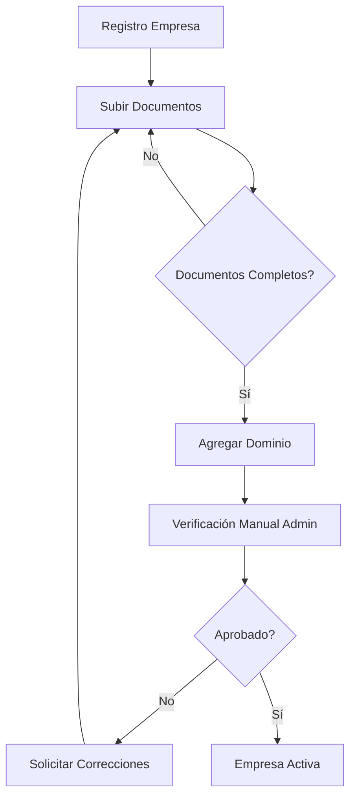

# 📘 API Contract - Módulo AUTH + ONBOARD (B2B)

**Versión:** MVP 1.0  
**Base URL:** `http://localhost:3002/api`  
**Última actualización:** 19 Diciembre 2025

---

## 📋 Índice

1. [Autenticación Pública](#1-autenticación-pública)
2. [Registro de Empresa (Onboarding)](#2-registro-de-empresa-onboarding)
3. [Rutas Autenticadas B2B](#3-rutas-autenticadas-b2b)
4. [Gestión de Perfil Usuario](#4-gestión-de-perfil-usuario)
5. [Gestión de Empresa](#5-gestión-de-empresa)
6. [Gestión de Documentos](#6-gestión-de-documentos)
7. [Dashboard y Progreso](#7-dashboard-y-progreso)
8. [Gestión de Usuarios (Company Admin)](#8-gestión-de-usuarios-company-admin)
9. [Códigos de Error](#9-códigos-de-error)
10. [Estados y Flujos](#10-estados-y-flujos)

---

## 🔐 Autenticación General

### Headers Requeridos

```http
Content-Type: application/json
Authorization: Bearer <access_token>  # Solo para rutas autenticadas
```

### Tokens

| Token | TTL | Uso |
|-------|-----|-----|
| `access_token` | 15 minutos | Autenticación de requests |
| `refresh_token` | 7 días | Renovar access_token |

---

## 1. Autenticación Pública

### 1.1 Login

```http
POST /api/public/auth/login
```

**Rate Limit:** 20 requests / 15 minutos

#### Request Body

```json
{
  "email": "admin@latam.com",
  "password": "SecurePass123!",
  "remember_me": false
}
```

#### Response 200 - Éxito

```json
{
  "success": true,
  "access_token": "eyJhbGciOiJIUzI1NiIs...",
  "refresh_token": "eyJhbGciOiJIUzI1NiIs...",
  "token_type": "Bearer",
  "expires_in": 900,
  "user_info": {
    "user_id": "uuid-user-123",
    "email": "admin@latam.com",
    "name": "Juan Pérez",
    "company_id": "uuid-company-456",
    "company_name": "LATAM Airlines",
    "role": "COMPANY_ADMIN",
    "permissions": ["companies.read", "uploads.create", "uploads.read"],
    "is_admin": true
  },
  "meta": {
    "login_time": "2025-01-15T10:30:00.000Z",
    "expires_at": "2025-01-15T10:45:00.000Z"
  }
}
```

#### Response 401 - Credenciales Inválidas

```json
{
  "success": false,
  "error_code": "INVALID_CREDENTIALS",
  "error_message": "Email o contraseña incorrectos"
}
```

#### Response 429 - Rate Limit

```json
{
  "success": false,
  "error_code": "RATE_LIMIT_EXCEEDED",
  "error_message": "Account temporarily locked due to too many failed attempts",
  "retry_after": 900
}
```

#### Response 403 - Cuenta Inactiva

```json
{
  "success": false,
  "error_code": "ACCOUNT_INACTIVE",
  "error_message": "Cuenta inactiva. Contacte al administrador."
}
```

---

### 1.2 Refresh Token

```http
POST /api/public/auth/refresh
```

#### Request Body

```json
{
  "refreshToken": "eyJhbGciOiJIUzI1NiIs..."
}
```

#### Response 200 - Éxito

```json
{
  "success": true,
  "access_token": "eyJhbGciOiJIUzI1NiIs...",
  "refresh_token": "eyJhbGciOiJIUzI1NiIs...",
  "token_type": "Bearer",
  "expires_in": 900,
  "user_info": {
    "user_id": "uuid-user-123",
    "email": "admin@latam.com",
    "name": "Juan Pérez",
    "company_id": "uuid-company-456",
    "company_name": "LATAM Airlines",
    "role": "COMPANY_ADMIN",
    "permissions": ["companies.read", "uploads.create"],
    "is_admin": true
  }
}
```

#### Response 401 - Token Inválido

```json
{
  "success": false,
  "error_code": "INVALID_REFRESH_TOKEN",
  "error_message": "Refresh token inválido. Inicie sesión nuevamente."
}
```

---

## 2. Registro de Empresa (Onboarding)

### 2.1 Registrar Nueva Empresa

```http
POST /api/public/companies/register
```

**Rate Limit:** 10 requests / 1 hora

#### Request Body

```json
{
  "razonSocial": "LATAM Airlines Group S.A.",
  "rut": "96.846.720-0",
  "nombreComercial": "LATAM Airlines",
  "giroSii": "Transporte Aéreo de Pasajeros",
  "tamanoEmpresa": "grande",
  "direccion": "Av. Presidente Riesco 5711, Las Condes, Santiago",
  "phone": "+56 2 2565 1234",
  "adminUser": {
    "email": "admin@latam.com",
    "name": "Juan Pérez García",
    "password": "SecurePass123!"
  }
}
```

#### Validaciones

| Campo | Reglas |
|-------|--------|
| `razonSocial` | Requerido, 3-200 caracteres |
| `rut` | Requerido, formato chileno válido (XX.XXX.XXX-X) |
| `nombreComercial` | Opcional, 2-100 caracteres |
| `giroSii` | Opcional, max 200 caracteres |
| `tamanoEmpresa` | Requerido: `micro`, `pequena`, `mediana`, `grande` |
| `direccion` | Opcional, max 300 caracteres |
| `phone` | Opcional, formato E.164 recomendado |
| `adminUser.email` | Requerido, email válido |
| `adminUser.name` | Requerido, 2-100 caracteres |
| `adminUser.password` | Requerido, mínimo 8 chars, 1 mayúscula, 1 minúscula, 1 número |

#### Response 201 - Éxito

```json
{
  "success": true,
  "message": "Empresa registrada exitosamente",
  "data": {
    "company": {
      "id": "uuid-company-456",
      "razonSocial": "LATAM Airlines Group S.A.",
      "rut": "96.846.720-0",
      "slugPublico": null,
      "status": "registered",
      "createdAt": "2025-01-15T10:30:00.000Z"
    },
    "user": {
      "id": "uuid-user-123",
      "email": "admin@latam.com",
      "name": "Juan Pérez García"
    },
    "nextSteps": [
      "Verificar email de bienvenida",
      "Completar documentación legal",
      "Verificar dominio corporativo",
      "Esperar aprobación de equipo"
    ]
  }
}
```

#### Response 400 - RUT Inválido

```json
{
  "success": false,
  "message": "RUT inválido",
  "error": "RUT inválido: dígito verificador incorrecto"
}
```

#### Response 409 - Ya Existe

```json
{
  "success": false,
  "message": "Empresa o usuario ya existe",
  "error": "Una empresa con este RUT ya existe"
}
```

---

### 2.2 Obtener Configuración de Documentos

```http
GET /api/public/config/documents
```

#### Response 200

```json
{
  "success": true,
  "data": {
    "documentTypes": {
      "contrato_servicio": {
        "name": "Contrato de Servicio",
        "required": true,
        "description": "Contrato firmado con CompensaTuViaje"
      },
      "rut_empresa": {
        "name": "RUT Empresa",
        "required": true,
        "description": "Documento RUT de la empresa"
      },
      "poder_representante": {
        "name": "Poder del Representante",
        "required": true,
        "description": "Poder notarial del representante legal"
      },
      "certificado_vigencia": {
        "name": "Certificado de Vigencia",
        "required": false,
        "description": "Certificado de vigencia de la sociedad"
      }
    },
    "maxFileSize": 10485760,
    "allowedMimeTypes": [
      "application/pdf",
      "image/jpeg",
      "image/png",
      "application/msword",
      "application/vnd.openxmlformats-officedocument.wordprocessingml.document"
    ],
    "maxFileSizeMB": 10
  }
}
```

---

### 2.3 Validar Código de Aeropuerto

```http
POST /api/public/validate/airport-code
```

**Rate Limit:** 50 requests / 1 minuto

#### Request Body

```json
{
  "code": "SCL"
}
```

#### Response 200 - Válido

```json
{
  "success": true,
  "message": "Código de aeropuerto válido",
  "data": {
    "iataCode": "SCL",
    "name": "Arturo Merino Benítez International Airport",
    "city": "Santiago",
    "country": "Chile",
    "latitude": -33.393,
    "longitude": -70.786
  }
}
```

#### Response 400 - Inválido

```json
{
  "success": false,
  "message": "Código de aeropuerto no encontrado"
}
```

---

### 2.4 Verificar Dominio

```http
GET /api/public/validate/domain-info/:domain
```

#### Response 200

```json
{
  "success": true,
  "data": {
    "domain": "latam.com",
    "exists": true,
    "message": "Dominio es accesible"
  }
}
```

---

## 3. Rutas Autenticadas B2B

> ⚠️ **IMPORTANTE**: Todas las rutas `/api/b2b/*` requieren:
> 1. Header `Authorization: Bearer <access_token>`
> 2. Usuario con empresa asociada

---

## 4. Gestión de Perfil Usuario

### 4.1 Obtener Mi Perfil

```http
GET /api/b2b/profile
```

#### Response 200

```json
{
  "success": true,
  "data": {
    "id": "uuid-user-123",
    "email": "admin@latam.com",
    "name": "Juan Pérez García",
    "isActive": true,
    "lastLoginAt": "2025-01-15T10:30:00.000Z",
    "createdAt": "2025-01-01T00:00:00.000Z",
    "company": {
      "id": "uuid-company-456",
      "razonSocial": "LATAM Airlines Group S.A.",
      "rut": "96.846.720-0",
      "status": "active"
    },
    "roles": ["COMPANY_ADMIN"],
    "permissions": ["companies.read", "companies.update", "uploads.create", "uploads.read"]
  }
}
```

---

### 4.2 Actualizar Mi Perfil

```http
PUT /api/b2b/profile
```

#### Request Body

```json
{
  "name": "Juan Carlos Pérez García",
  "preferences": {
    "notifications_email": true,
    "language": "es"
  }
}
```

#### Response 200

```json
{
  "success": true,
  "message": "Perfil actualizado exitosamente",
  "data": {
    "id": "uuid-user-123",
    "email": "admin@latam.com",
    "name": "Juan Carlos Pérez García",
    "preferences": {
      "notifications_email": true,
      "language": "es"
    }
  }
}
```

---

### 4.3 Cambiar Contraseña

```http
PUT /api/b2b/profile/password
```

#### Request Body

```json
{
  "currentPassword": "OldSecurePass123!",
  "newPassword": "NewSecurePass456!"
}
```

#### Validaciones Password

- Mínimo 8 caracteres
- Al menos 1 mayúscula
- Al menos 1 minúscula
- Al menos 1 número

#### Response 200

```json
{
  "success": true,
  "message": "Contraseña actualizada exitosamente"
}
```

#### Response 400 - Password Actual Incorrecto

```json
{
  "success": false,
  "message": "Contraseña actual incorrecta"
}
```

---

### 4.4 Actualizar Email

```http
PUT /api/b2b/profile/email
```

#### Request Body

```json
{
  "newEmail": "nuevo.email@latam.com",
  "currentPassword": "SecurePass123!"
}
```

#### Response 200

```json
{
  "success": true,
  "message": "Email actualizado. Se requiere verificación.",
  "data": {
    "newEmail": "nuevo.email@latam.com",
    "requiresVerification": true
  }
}
```

---

### 4.5 Obtener Info Usuario Actual (Me)

```http
GET /api/b2b/profile/me
```

#### Response 200

```json
{
  "success": true,
  "user_info": {
    "user_id": "uuid-user-123",
    "email": "admin@latam.com",
    "name": "Juan Pérez García",
    "company_id": "uuid-company-456",
    "company_name": "LATAM Airlines Group S.A.",
    "role": "COMPANY_ADMIN",
    "permissions": ["companies.read", "companies.update", "uploads.create"],
    "is_admin": true
  }
}
```

---

### 4.6 Logout

```http
POST /api/b2b/profile/logout
```

#### Response 200

```json
{
  "success": true,
  "message": "Sesión cerrada exitosamente"
}
```

---

## 5. Gestión de Empresa

### 5.1 Obtener Mi Empresa

```http
GET /api/b2b/company
```

**Permisos:** `companies.read`

#### Response 200

```json
{
  "success": true,
  "data": {
    "id": "uuid-company-456",
    "razonSocial": "LATAM Airlines Group S.A.",
    "rut": "96.846.720-0",
    "nombreComercial": "LATAM Airlines",
    "giroSii": "Transporte Aéreo de Pasajeros",
    "tamanoEmpresa": "grande",
    "direccion": "Av. Presidente Riesco 5711",
    "phone": "+56 2 2565 1234",
    "slugPublico": "latam-airlines",
    "publicProfileOptIn": true,
    "status": "active",
    "createdAt": "2025-01-01T00:00:00.000Z",
    "updatedAt": "2025-01-15T10:30:00.000Z"
  }
}
```

---

### 5.2 Actualizar Mi Empresa

```http
PUT /api/b2b/company
```

**Permisos:** `companies.update`

#### Request Body

```json
{
  "nombreComercial": "LATAM Airlines Chile",
  "direccion": "Nueva dirección 123",
  "phone": "+56 2 2565 9999",
  "slugPublico": "latam-chile",
  "publicProfileOptIn": true
}
```

#### Response 200

```json
{
  "success": true,
  "message": "Empresa actualizada exitosamente",
  "data": {
    "id": "uuid-company-456",
    "razonSocial": "LATAM Airlines Group S.A.",
    "nombreComercial": "LATAM Airlines Chile",
    "slugPublico": "latam-chile"
  }
}
```

---

### 5.3 Listar Dominios de Mi Empresa

```http
GET /api/b2b/company/domains
```

**Permisos:** `companies.read`

#### Response 200

```json
{
  "success": true,
  "data": [
    {
      "id": "uuid-domain-1",
      "domain": "latam.com",
      "verified": true,
      "verifiedAt": "2025-01-05T10:00:00.000Z",
      "createdAt": "2025-01-01T00:00:00.000Z"
    },
    {
      "id": "uuid-domain-2",
      "domain": "latam.cl",
      "verified": false,
      "verifiedAt": null,
      "createdAt": "2025-01-10T00:00:00.000Z"
    }
  ],
  "count": 2,
  "verifiedCount": 1
}
```

---

### 5.4 Agregar Dominio Corporativo

```http
POST /api/b2b/company/domains
```

**Permisos:** `companies.update`

#### Request Body

```json
{
  "domain": "latam.pe"
}
```

#### Response 201

```json
{
  "success": true,
  "message": "Dominio agregado para verificación",
  "data": {
    "id": "uuid-domain-3",
    "domain": "latam.pe",
    "verified": false,
    "createdAt": "2025-01-15T10:30:00.000Z",
    "nextSteps": [
      "Esperar verificación manual del equipo",
      "Revisar configuración DNS del dominio",
      "Verificar que el dominio esté activo"
    ]
  }
}
```

---

### 5.5 Validar Email Corporativo

```http
POST /api/b2b/company/validate-email
```

**Permisos:** `companies.read`

#### Request Body

```json
{
  "email": "empleado@latam.com",
  "companyId": "uuid-company-456"
}
```

#### Response 200

```json
{
  "success": true,
  "data": {
    "email": "empleado@latam.com",
    "isValid": true,
    "message": "Email pertenece a un dominio verificado de la empresa"
  }
}
```

---

## 6. Gestión de Documentos

### 6.1 Listar Documentos de Mi Empresa

```http
GET /api/b2b/documents
```

**Permisos:** `uploads.read`

#### Query Parameters

| Param | Tipo | Descripción |
|-------|------|-------------|
| `docType` | string | Filtrar por tipo: `contrato_servicio`, `rut_empresa`, etc. |

#### Response 200

```json
{
  "success": true,
  "data": [
    {
      "id": "uuid-doc-1",
      "docType": "contrato_servicio",
      "status": "uploaded",
      "uploadedAt": "2025-01-10T14:30:00.000Z",
      "file": {
        "id": "uuid-file-1",
        "fileName": "contrato_firmado.pdf",
        "mimeType": "application/pdf",
        "sizeBytes": 2458624,
        "checksum": "abc123..."
      }
    },
    {
      "id": "uuid-doc-2",
      "docType": "rut_empresa",
      "status": "uploaded",
      "uploadedAt": "2025-01-10T14:35:00.000Z",
      "file": {
        "id": "uuid-file-2",
        "fileName": "rut_empresa.pdf",
        "mimeType": "application/pdf",
        "sizeBytes": 512000,
        "checksum": "def456..."
      }
    }
  ],
  "count": 2,
  "documentTypes": {
    "contrato_servicio": { "name": "Contrato de Servicio", "required": true },
    "rut_empresa": { "name": "RUT Empresa", "required": true },
    "poder_representante": { "name": "Poder del Representante", "required": true },
    "certificado_vigencia": { "name": "Certificado de Vigencia", "required": false }
  }
}
```

---

### 6.2 Subir Documento

```http
POST /api/b2b/documents
```

**Permisos:** `uploads.create`  
**Rate Limit:** 20 requests / 10 minutos  
**Content-Type:** `multipart/form-data`

#### Form Data

| Campo | Tipo | Requerido | Descripción |
|-------|------|-----------|-------------|
| `file` | File | ✅ | Archivo a subir (max 10MB) |
| `docType` | string | ✅ | Tipo de documento |
| `description` | string | ❌ | Descripción opcional |

#### Tipos de Documento Válidos

- `contrato_servicio` (requerido)
- `rut_empresa` (requerido)
- `poder_representante` (requerido)
- `certificado_vigencia` (opcional)

#### Response 201

```json
{
  "success": true,
  "message": "Documento subido exitosamente",
  "data": {
    "document": {
      "id": "uuid-doc-new",
      "docType": "contrato_servicio",
      "status": "uploaded",
      "uploadedAt": "2025-01-15T10:30:00.000Z"
    },
    "file": {
      "id": "uuid-file-new",
      "fileName": "contrato_firmado.pdf",
      "mimeType": "application/pdf",
      "sizeBytes": 2458624
    },
    "metadata": {
      "checksum": "sha256:abc123...",
      "uploadDuration": 1234
    }
  }
}
```

#### Response 400 - Archivo Muy Grande

```json
{
  "success": false,
  "message": "Archivo demasiado grande",
  "maxSize": "10MB"
}
```

#### Response 400 - Tipo No Permitido

```json
{
  "success": false,
  "message": "Tipo de archivo no permitido",
  "allowedTypes": ["application/pdf", "image/jpeg", "image/png"]
}
```

---

### 6.3 Validar Documentos

```http
GET /api/b2b/documents/validation
```

**Permisos:** `uploads.read`

#### Response 200

```json
{
  "success": true,
  "data": {
    "isValid": false,
    "errors": [
      "Documento requerido faltante: poder_representante"
    ],
    "warnings": [
      "Documento opcional no subido: certificado_vigencia"
    ],
    "documentSummary": {
      "contrato_servicio": {
        "name": "Contrato de Servicio",
        "required": true,
        "uploaded": 1,
        "status": "complete"
      },
      "rut_empresa": {
        "name": "RUT Empresa",
        "required": true,
        "uploaded": 1,
        "status": "complete"
      },
      "poder_representante": {
        "name": "Poder del Representante",
        "required": true,
        "uploaded": 0,
        "status": "missing"
      },
      "certificado_vigencia": {
        "name": "Certificado de Vigencia",
        "required": false,
        "uploaded": 0,
        "status": "optional"
      }
    },
    "completionPercentage": 67
  }
}
```

---

### 6.4 Descargar Documento

```http
GET /api/b2b/documents/:id/download
```

**Permisos:** `uploads.read`  
**Rate Limit:** 30 requests / 1 minuto

#### Response 200

Archivo binario con headers:

```http
Content-Type: application/pdf
Content-Length: 2458624
Content-Disposition: attachment; filename="contrato_firmado.pdf"
```

---

### 6.5 Eliminar Documento

```http
DELETE /api/b2b/documents/:id
```

**Permisos:** `uploads.create`

#### Response 200

```json
{
  "success": true,
  "message": "Documento eliminado exitosamente"
}
```

---

## 7. Dashboard y Progreso

### 7.1 Dashboard de Mi Empresa

```http
GET /api/b2b/dashboard
```

**Permisos:** `companies.read`

#### Response 200

```json
{
  "success": true,
  "data": {
    "company": {
      "id": "uuid-company-456",
      "razonSocial": "LATAM Airlines Group S.A.",
      "rut": "96.846.720-0",
      "status": "pending_contract",
      "createdAt": "2025-01-01T00:00:00.000Z"
    },
    "progress": {
      "overall": 50,
      "steps": {
        "registration": {
          "name": "Registro Inicial",
          "completed": true,
          "percentage": 100,
          "completedAt": "2025-01-01T00:00:00.000Z"
        },
        "documents": {
          "name": "Documentación Legal",
          "completed": false,
          "percentage": 67,
          "completedAt": null
        },
        "domains": {
          "name": "Verificación Dominios",
          "completed": true,
          "percentage": 100,
          "completedAt": "2025-01-05T10:00:00.000Z"
        },
        "approval": {
          "name": "Aprobación Final",
          "completed": false,
          "percentage": 0,
          "completedAt": null
        }
      }
    },
    "documents": {
      "total": 2,
      "required": 3,
      "uploaded": 2,
      "completionPercentage": 67,
      "isValid": false
    },
    "domains": {
      "total": 1,
      "verified": 1,
      "pending": 0
    },
    "users": {
      "total": 3,
      "admins": 1
    },
    "nextSteps": [
      {
        "action": "upload_documents",
        "title": "Completar documentación legal",
        "description": "Subir los documentos requeridos para validar la empresa",
        "priority": "high"
      }
    ],
    "estimatedTimeToComplete": "2-3 días"
  }
}
```

---

### 7.2 Progreso de Onboarding

```http
GET /api/b2b/dashboard/progress
```

**Permisos:** `companies.read`

#### Response 200

```json
{
  "success": true,
  "data": {
    "companyId": "uuid-company-456",
    "currentStatus": "pending_contract",
    "overallProgress": 50,
    "steps": {
      "registration": {
        "name": "Registro Inicial",
        "completed": true,
        "percentage": 100
      },
      "documents": {
        "name": "Documentación Legal",
        "completed": false,
        "percentage": 67
      },
      "domains": {
        "name": "Verificación Dominios",
        "completed": true,
        "percentage": 100
      },
      "approval": {
        "name": "Aprobación Final",
        "completed": false,
        "percentage": 0
      }
    },
    "blockers": [
      {
        "type": "documents",
        "message": "Documentos requeridos faltantes",
        "details": ["poder_representante no subido"]
      }
    ],
    "recommendations": [
      "Completar la documentación legal pendiente"
    ]
  }
}
```

---

### 7.3 Timeline de Eventos

```http
GET /api/b2b/dashboard/timeline
```

**Permisos:** `companies.read`

#### Response 200

```json
{
  "success": true,
  "data": [
    {
      "type": "status_change",
      "timestamp": "2025-01-10T14:00:00.000Z",
      "title": "Estado cambiado: registered → pending_contract",
      "description": "Documentación inicial recibida",
      "actor": {
        "name": "Sistema"
      },
      "metadata": {
        "fromStatus": "registered",
        "toStatus": "pending_contract"
      }
    },
    {
      "type": "document_upload",
      "timestamp": "2025-01-10T13:45:00.000Z",
      "title": "Documento subido: contrato_servicio",
      "description": "Archivo: contrato_firmado.pdf",
      "metadata": {
        "docType": "contrato_servicio",
        "fileName": "contrato_firmado.pdf"
      }
    },
    {
      "type": "system_event",
      "timestamp": "2025-01-01T00:00:00.000Z",
      "title": "Empresa registrada",
      "description": "COMPANY_CREATED",
      "actor": {
        "name": "Juan Pérez García"
      }
    }
  ]
}
```

---

## 8. Gestión de Usuarios (Company Admin)

> ⚠️ **Estas rutas solo están disponibles para usuarios con rol `COMPANY_ADMIN`**

### 8.1 Listar Usuarios de Mi Empresa

```http
GET /api/b2b/users
```

**Permisos:** Requiere `COMPANY_ADMIN`

#### Query Parameters

| Param | Tipo | Default | Descripción |
|-------|------|---------|-------------|
| `page` | number | 1 | Página |
| `limit` | number | 20 | Límite por página (max 100) |
| `search` | string | - | Buscar por nombre/email |
| `role` | string | - | Filtrar por rol |
| `status` | string | - | `active`, `inactive`, `all` |

#### Response 200

```json
{
  "success": true,
  "data": {
    "users": [
      {
        "id": "uuid-user-1",
        "email": "admin@latam.com",
        "name": "Juan Pérez",
        "isActive": true,
        "isAdmin": true,
        "roles": ["COMPANY_ADMIN"],
        "lastLoginAt": "2025-01-15T10:30:00.000Z",
        "createdAt": "2025-01-01T00:00:00.000Z"
      },
      {
        "id": "uuid-user-2",
        "email": "operador@latam.com",
        "name": "María García",
        "isActive": true,
        "isAdmin": false,
        "roles": ["COMPANY_OPERATOR"],
        "lastLoginAt": "2025-01-14T09:00:00.000Z",
        "createdAt": "2025-01-05T00:00:00.000Z"
      }
    ],
    "pagination": {
      "page": 1,
      "limit": 20,
      "total": 2,
      "totalPages": 1
    }
  }
}
```

---

### 8.2 Crear Usuario

```http
POST /api/b2b/users
```

**Permisos:** Requiere `COMPANY_ADMIN`

#### Request Body

```json
{
  "email": "nuevo.usuario@latam.com",
  "name": "Carlos López",
  "role": "COMPANY_OPERATOR"
}
```

#### Roles Disponibles

| Rol | Permisos |
|-----|----------|
| `COMPANY_ADMIN` | Todos los permisos de la empresa |
| `COMPANY_OPERATOR` | Subir documentos, ver dashboard |
| `COMPANY_VIEWER` | Solo lectura |

#### Response 201

```json
{
  "success": true,
  "message": "Usuario creado exitosamente",
  "data": {
    "user": {
      "id": "uuid-user-new",
      "email": "nuevo.usuario@latam.com",
      "name": "Carlos López",
      "roles": ["COMPANY_OPERATOR"]
    },
    "temporaryPassword": "TempPass123!",
    "instructions": "El usuario debe cambiar esta contraseña en su primer login"
  }
}
```

---

### 8.3 Actualizar Usuario

```http
PUT /api/b2b/users/:userId
```

**Permisos:** Requiere `COMPANY_ADMIN`

#### Request Body

```json
{
  "name": "Carlos Antonio López",
  "role": "COMPANY_ADMIN"
}
```

#### Response 200

```json
{
  "success": true,
  "message": "Usuario actualizado exitosamente",
  "data": {
    "id": "uuid-user-2",
    "email": "operador@latam.com",
    "name": "Carlos Antonio López",
    "roles": ["COMPANY_ADMIN"]
  }
}
```

---

### 8.4 Desactivar Usuario

```http
DELETE /api/b2b/users/:userId
```

**Permisos:** Requiere `COMPANY_ADMIN`

> ⚠️ Soft delete - el usuario se marca como inactivo pero no se elimina

#### Response 200

```json
{
  "success": true,
  "message": "Usuario desactivado exitosamente",
  "data": {
    "id": "uuid-user-2",
    "isActive": false
  }
}
```

#### Response 400 - No Puede Desactivarse

```json
{
  "success": false,
  "message": "No puedes desactivar tu propia cuenta"
}
```

---

### 8.5 Reactivar Usuario

```http
POST /api/b2b/users/:userId/reactivate
```

**Permisos:** Requiere `COMPANY_ADMIN`

#### Response 200

```json
{
  "success": true,
  "message": "Usuario reactivado exitosamente",
  "data": {
    "id": "uuid-user-2",
    "isActive": true
  }
}
```

---

### 8.6 Resetear Contraseña de Usuario

```http
POST /api/b2b/users/:userId/reset-password
```

**Permisos:** Requiere `COMPANY_ADMIN`

#### Response 200

```json
{
  "success": true,
  "message": "Contraseña reseteada exitosamente",
  "data": {
    "temporaryPassword": "NewTempPass456!",
    "instructions": "El usuario debe cambiar esta contraseña en su próximo login"
  }
}
```

---

## 9. Códigos de Error

### Errores de Autenticación

| Código | HTTP | Descripción |
|--------|------|-------------|
| `VALIDATION_ERROR` | 400 | Datos de entrada inválidos |
| `INVALID_CREDENTIALS` | 401 | Email o contraseña incorrectos |
| `INVALID_REFRESH_TOKEN` | 401 | Token de refresh inválido |
| `USER_NOT_FOUND` | 401 | Usuario no encontrado |
| `ACCOUNT_INACTIVE` | 403 | Cuenta desactivada |
| `NO_ACTIVE_COMPANIES` | 403 | Sin empresas activas |
| `RATE_LIMIT_EXCEEDED` | 429 | Demasiados intentos |
| `SYSTEM_ERROR` | 500 | Error interno |

### Errores de Permisos

| Código | HTTP | Descripción |
|--------|------|-------------|
| `INSUFFICIENT_PERMISSIONS` | 403 | Sin permisos para la acción |
| `COMPANY_NOT_ACTIVE` | 403 | Empresa no activa |
| `CROSS_COMPANY_ACCESS_DENIED` | 403 | Intento de acceder a otra empresa |

### Errores de Validación

| Código | HTTP | Descripción |
|--------|------|-------------|
| `EMAIL_ALREADY_EXISTS` | 400 | Email ya registrado |
| `INVALID_CURRENT_PASSWORD` | 400 | Contraseña actual incorrecta |
| `INVALID_ROLE_ASSIGNMENT` | 400 | Rol no permitido |
| `CANNOT_DEMOTE_SELF` | 400 | No puede reducir su propio rol |
| `CANNOT_DEACTIVATE_SELF` | 400 | No puede desactivarse |
| `USER_ALREADY_INACTIVE` | 400 | Usuario ya inactivo |
| `USER_ALREADY_ACTIVE` | 400 | Usuario ya activo |

---

## 10. Estados y Flujos

### Estados de Empresa

```
registered → pending_contract → signed → active
                                    ↓
                               suspended
```

| Estado | Descripción | Permisos |
|--------|-------------|----------|
| `registered` | Recién registrada | Solo subir documentos |
| `pending_contract` | Esperando firma contrato | Solo lectura + documentos |
| `signed` | Contrato firmado, activación pendiente | Solo lectura |
| `active` | Totalmente operativa | Todos los permisos |
| `suspended` | Suspendida por admin | Solo lectura básica |

### Flujo de Onboarding



---

## 📦 Modelo de Datos Simplificado

### User

```typescript
interface User {
  id: string;
  email: string;
  name: string;
  isActive: boolean;
  lastLoginAt: string | null;
  createdAt: string;
  updatedAt: string;
}
```

### Company

```typescript
interface Company {
  id: string;
  razonSocial: string;
  rut: string;
  nombreComercial: string | null;
  giroSii: string | null;
  tamanoEmpresa: 'micro' | 'pequena' | 'mediana' | 'grande';
  direccion: string | null;
  phone: string | null;
  slugPublico: string | null;
  publicProfileOptIn: boolean;
  status: 'registered' | 'pending_contract' | 'signed' | 'active' | 'suspended';
  createdAt: string;
  updatedAt: string;
}
```

### CompanyDocument

```typescript
interface CompanyDocument {
  id: string;
  docType: string;
  status: string;
  uploadedAt: string;
  file: {
    id: string;
    fileName: string;
    mimeType: string;
    sizeBytes: number;
  };
}
```

### CompanyDomain

```typescript
interface CompanyDomain {
  id: string;
  domain: string;
  verified: boolean;
  verifiedAt: string | null;
  createdAt: string;
}
```

---

## 🔧 Configuración Frontend Recomendada

### Axios Interceptor Ejemplo

```typescript
// api/client.ts
import axios from 'axios';

const api = axios.create({
  baseURL: 'http://localhost:3002/api',
  headers: {
    'Content-Type': 'application/json'
  }
});

// Interceptor para agregar token
api.interceptors.request.use((config) => {
  const token = localStorage.getItem('access_token');
  if (token) {
    config.headers.Authorization = `Bearer ${token}`;
  }
  return config;
});

// Interceptor para manejar refresh token
api.interceptors.response.use(
  (response) => response,
  async (error) => {
    if (error.response?.status === 401 && !error.config._retry) {
      error.config._retry = true;
      
      try {
        const refreshToken = localStorage.getItem('refresh_token');
        const { data } = await axios.post('/api/public/auth/refresh', {
          refreshToken
        });
        
        localStorage.setItem('access_token', data.access_token);
        localStorage.setItem('refresh_token', data.refresh_token);
        
        error.config.headers.Authorization = `Bearer ${data.access_token}`;
        return api(error.config);
      } catch (refreshError) {
        localStorage.clear();
        window.location.href = '/login';
      }
    }
    return Promise.reject(error);
  }
);

export default api;
```

---

**Documento generado automáticamente - CompensaTuViaje MVP v1.0**
